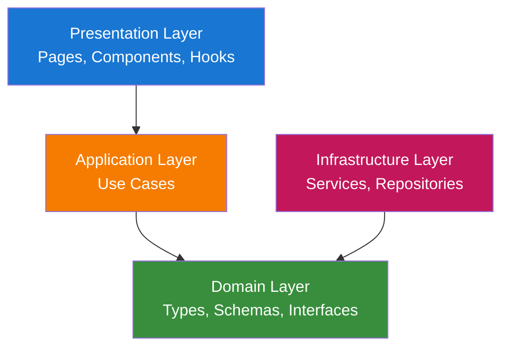
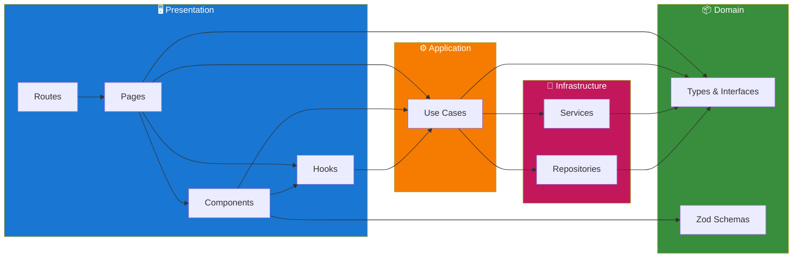
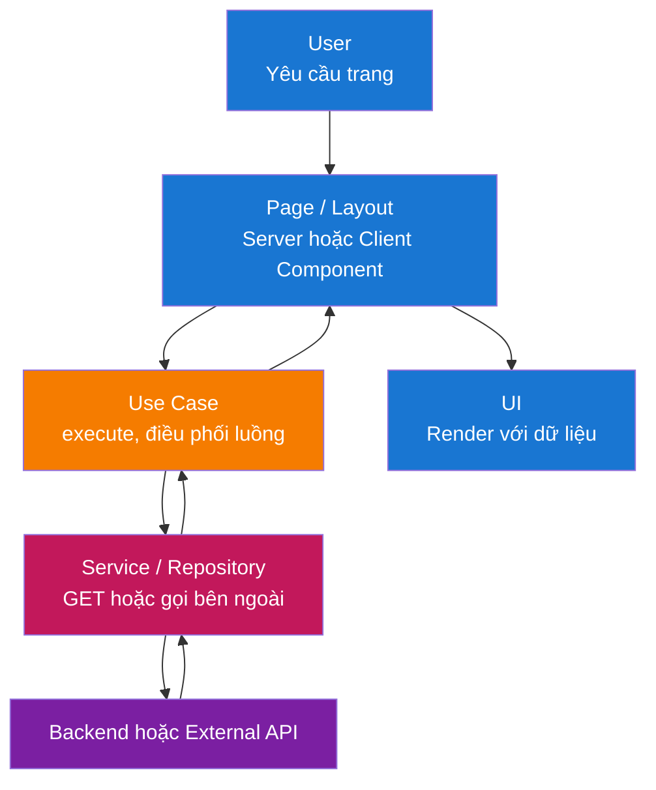
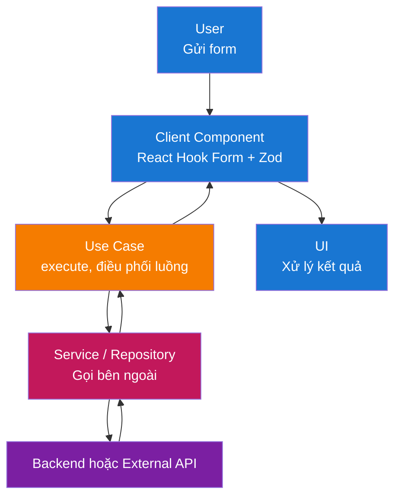
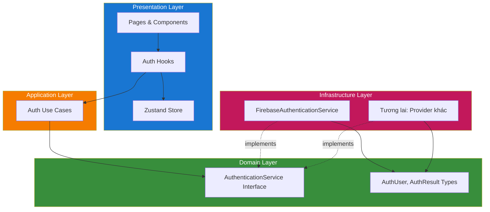

# Kiến trúc

Frontend này tuân theo **Clean Architecture** với cấu trúc **module**. Ứng dụng dễ bảo trì, dễ testing và phù hợp với Next.js cùng UI stack đã chọn.

## Mục lục

1. [Tổng quan kiến trúc](#tổng-quan-kiến-trúc)
2. [Cấu trúc layer](#cấu-trúc-layer)
3. [Luồng dữ liệu](#luồng-dữ-liệu)
4. [Trách nhiệm từng layer](#trách-nhiệm-từng-layer)
   - [Domain Layer](#1-domain-layer-srcmodulesmoduledomain)
   - [Application Layer](#2-application-layer-srcmodulesmoduleapplication)
   - [Infrastructure Layer](#3-infrastructure-layer-srcmodulesmoduleinfrastructure)
   - [Presentation Layer](#4-presentation-layer-srcmodulesmodulepresentation)
5. [Cấu trúc module](#cấu-trúc-module)
6. [Các mẫu thiết kế quan trọng](#các-mẫu-thiết-kế-quan-trọng)
7. [Xác thực](#xác-thực)
8. [Technology Stack](#technology-stack)

## Tổng quan kiến trúc

Giải pháp được tổ chức theo các layer đảm bảo tách biệt trách nhiệm và đảo ngược phụ thuộc:



**Mô tả các layer:**

- **Presentation Layer**: Điểm vào tương tác người dùng—trang Next.js, layout và component React. Layer này render UI và xử lý đầu vào, ủy thác logic nghiệp vụ và dữ liệu cho application layer.

- **Application Layer**: Điều phối use case và logic ứng dụng—lấy dữ liệu, xử lý gửi form, điều phối validation và phối hợp quy tắc domain với infrastructure. Không có UI hay chi tiết framework ở đây.

- **Domain Layer**: Types cốt lõi, Zod schemas và interfaces dùng trong toàn app. Không phụ thuộc bên ngoài; định nghĩa hình dạng dữ liệu và quy tắc validation (vd. API contracts, form payloads).

- **Infrastructure Layer**: Triển khai kỹ thuật—services (tích hợp bên ngoài như Firebase) và repositories (truy cập dữ liệu). Thực hiện interface do domain layer định nghĩa.

## Cấu trúc layer

Cấu trúc layer đầy đủ với tất cả thành phần:



**Chi tiết layer:**

| Layer | Vị trí | Nội dung |
|-------|--------|----------|
| **Presentation** | `app/`, `presentation/` | Routes, Pages, Components, Hooks |
| **Application** | `application/` | Use Cases |
| **Domain** | `domain/` | types.ts, schemas.ts, interfaces.ts |
| **Infrastructure** | `infrastructure/` | Services, Repositories |

**Thiết lập cấp app** (không phải layer): `src/application/` chứa `register-container.ts` và app config. DI Container utilities nằm trong `src/common/utils/container.ts`.

## Luồng dữ liệu

### Luồng đọc (Server hoặc Client Page)



### Luồng ghi (Form Submission)



## Trách nhiệm từng layer

### 1. Domain Layer (`src/modules/{module}/domain/`)

Types và validation cốt lõi, không phụ thuộc bên ngoài. Khái niệm domain dùng chung có thể nằm trong domain của module hoặc common interfaces.

**Thành phần:**

- **Types**: Interfaces và type aliases cho API response, form state và khái niệm module (vd. auth types trong `src/modules/auth/domain/types.ts`).
- **Zod Schemas**: Validation và parse cho form trong `domain/schemas.ts` mỗi module.
- **Constants**: Hằng số liên quan domain (vd. route paths, error codes) dùng trong module.

**Nguyên tắc:**

- Không phụ thuộc layer khác hay framework.
- Chỉ types và schemas; không I/O, không React, không Next.

### 2. Application Layer (`src/modules/{module}/application/`)

Điều phối use case và logic ứng dụng. Use case được resolve từ DI container; module đăng ký qua `module-configuration.ts`.

**Thành phần:**

- **Use Cases**: Class (hoặc hàm) trong `src/modules/{module}/application/` thực hiện luồng ứng dụng (vd. `sign-in-with-email-use-case.ts`, `update-profile-use-case.ts`). Kế thừa `BaseUseCase` từ `src/common/utils/base-use-case.ts`, dùng domain types/schemas và phụ thuộc services hoặc API client qua container.
- **Module state**: State cấp module (vd. Zustand) expose qua hooks trong `src/modules/{module}/presentation/hooks/` (vd. `use-auth-user-store.ts`).
- **Data-fetching**: Server hoặc Client Components tải dữ liệu bằng cách resolve và gọi use case từ container.

**Nguyên tắc:**

- Chỉ phụ thuộc Domain và Infrastructure (inject qua Awilix).
- Không UI, không React trong class use case; chỉ điều phối.

### 3. Infrastructure Layer (`src/modules/{module}/infrastructure/`)

Triển khai vấn đề kỹ thuật và tích hợp bên ngoài. API client hoặc repositories theo module khi cần.

**Thành phần:**

- **Services**: Tích hợp bên ngoài trong `src/modules/{module}/infrastructure/services/` (vd. `firebase-auth-service.ts` trong auth). Thực hiện interface định nghĩa trong `src/modules/{module}/domain/interfaces.ts`.
- **Repositories**: Triển khai truy cập dữ liệu trong `src/modules/{module}/infrastructure/repositories/` (vd. `firestore-book-repository.ts` trong books). Thực hiện interface định nghĩa trong `src/modules/{module}/domain/interfaces.ts`.
- **API Client**: Khi app gọi backend HTTP API, client có thể nằm trong `src/common/` hoặc theo module và được đăng ký trong container.

**Nguyên tắc:**

- Thực hiện interface dùng bởi use case (inject qua container).
- Mọi I/O bên ngoài và dùng SDK nằm ở đây.

### 4. Presentation Layer (`src/modules/{module}/presentation/`)

Xử lý tương tác người dùng và render UI.

**Thành phần:**

- **App Routes**: `app/[locale]/**/page.tsx` (và route group như `(main)`) chỉ là routing layer. Chúng import và render page component từ `src/modules/{module}/presentation/pages/`.
- **Module Pages**: `src/modules/{module}/presentation/pages/{page}/page.tsx` chứa page component thực tế. Page có thể là Server hoặc Client Component; component riêng trang nằm trong `presentation/pages/{page}/components/`.
- **Module Components**: Component dùng chung module trong `src/modules/{module}/presentation/components/`.
- **Module Hooks**: Hooks riêng module trong `src/modules/{module}/presentation/hooks/` (vd. `use-auth-user-store.ts`, `use-sync-auth-state.ts`).
- **Common Components**: Component dùng chung trong `src/common/components/` (vd. form, input, label, root-layout, main-layout). Dùng `"use client"` chỉ khi cần (hooks, browser APIs, Zustand).

**Nguyên tắc:**

- Phụ thuộc Application (use case qua container) và Domain (chỉ types).
- Gắn với framework: Next.js App Router, React. Logic nghiệp vụ nằm trong use case và services.
- `/app` chỉ cho routing; toàn bộ code ứng dụng nằm trong `/src`.

## Cấu trúc module

App dùng `/src` làm thư mục nguồn chính, giữ `/app` chỉ cho routing. Code tổ chức theo **module** (theo tính năng) trong `/src`, với code dùng chung trong `/src/common`.

### Tổng quan cấu trúc dự án

```text
app/                               # Chỉ routing layer (Next.js App Router)
├── [locale]/                      # Segment locale (next-intl)
│   ├── layout.tsx, error.tsx, not-found.tsx
│   ├── (main)/                    # Route group: trang chính
│   │   ├── page.tsx, docs/, profile/, ...
│   └── auth/                      # Routes auth
│       ├── sign-in/, sign-up/, forgot-password/
├── globals.css, layout.tsx, not-found.tsx

src/                               # Toàn bộ code ứng dụng ở đây
├── __tests__/                     # Tests phản chiếu cấu trúc src
├── application/                   # Thiết lập cấp app
│   ├── components/                # AppInitializer
│   ├── config/                    # firebase-config, main-menu
│   ├── localization/              # request.ts, en.json, vi.json, zh.json
│   └── register-container.ts
├── common/                        # Code dùng chung mọi module
│   ├── components/                # button, form, main-layout, ...
│   ├── hooks/                     # use-container
│   ├── interfaces.ts              # MenuItem, ResolvedMenuItem
│   ├── pages/                     # error-page, not-found-page
│   ├── routing/                   # routing.ts, navigation.ts
│   └── utils/                     # cn, container, base-use-case, ...
│
├── modules/                       # Module tính năng (Clean Architecture)
│   ├── auth/                      # Ví dụ: Module Auth
│   │   ├── domain/                # types.ts, schemas.ts, interfaces.ts
│   │   ├── application/           # sign-in-use-case.ts, sign-out-use-case.ts, ...
│   │   ├── infrastructure/        # services/firebase-auth-service.ts
│   │   ├── presentation/
│   │   │   ├── components/        # auth-layout, auth-header-slot, ...
│   │   │   ├── hooks/             # use-auth-user-store, use-sync-auth-state
│   │   │   └── pages/             # sign-in/, sign-up/, profile/
│   │   ├── utils/
│   │   └── module-configuration.ts
│   │
│   ├── books/                     # Ví dụ: Module Books (CRUD)
│   ├── settings/                  # Ví dụ: Module User settings
│   ├── docs/, landing-page/       # Các module khác
│   │
│   └── {module-name}/             # Template module
│       ├── domain/                # types.ts, schemas.ts, interfaces.ts
│       ├── application/           # File use case
│       ├── infrastructure/        # services/, repositories/
│       ├── presentation/          # pages/, components/, hooks/
│       └── module-configuration.ts
```

Route group (vd. `(main)`) dùng layout chung cung cấp `MainLayout` với menu và auth slot; route auth dùng `AuthLayout`. Cách này giữ `/app` tối thiểu và toàn bộ code trong `/src` để dễ tổ chức và testing.

Xem [Coding Conventions](./coding-conventions-vi.md) để biết ví dụ routing và patterns chi tiết.

## Các mẫu thiết kế quan trọng

### 1. Clean Architecture / Layered Architecture

**Mục đích**: Tách biệt trách nhiệm và đảo ngược phụ thuộc (layer trong không phụ thuộc layer ngoài).

**Triển khai:**

- **Domain**: Types, Zod schemas, interfaces—không framework, không I/O.
- **Application**: Use case (trong `application/`); chỉ phụ thuộc Domain và interface Infrastructure, resolve qua Awilix.
- **Infrastructure**: Services và repositories (trong `infrastructure/`); thực hiện interface từ domain.
- **Presentation**: Pages, components và hooks (trong `presentation/`); phụ thuộc Application và types Domain.

**Lợi ích:**

- Dễ testing: Logic application và domain có thể test không cần UI hay HTTP thật.
- Dễ bảo trì: Thay đổi trong một layer được giới hạn.
- Linh hoạt: Đổi API client hoặc cách auth mà không đổi use case.

### 2. Cấu trúc tính năng theo module

**Mục đích**: Gom tính năng (auth, books, docs, landing-page, settings) và ranh giới rõ ràng.

**Triển khai:**

- Toàn bộ code trong `/src`; `/app` chỉ cho routing.
- Gom theo tính năng trong `src/modules/{feature}/` với `domain/` (types, schemas, interfaces), `application/` (use cases), `infrastructure/` (services, repositories), `presentation/` (pages, components, hooks), `utils/` và `module-configuration.ts` cho đăng ký DI.
- Code dùng chung (components, hooks, routing, utils, container) trong `src/common/`. Thiết lập cấp app (đăng ký container, config, localization) trong `src/application/`.

**Lợi ích:**

- Quyền sở hữu và khả năng tìm kiếm rõ.
- Cùng mô hình với backend module mà không phức tạp DDD.
- Dễ test hơn khi code tách khỏi routing và use case resolve qua container.

### 3. Dependency Injection (Awilix)

**Mục đích**: Resolve use case và services từ container để components tách biệt và dễ test.

**Triển khai:**

- Container tạo trong `src/common/utils/container.ts` với `injectionMode: InjectionMode.PROXY` và đăng ký trong `src/application/register-container.ts`.
- Mỗi module expose `registerModule(container)` trong `module-configuration.ts`, đăng ký use case và services (vd. `asFunction(cradle => new SignInWithEmailUseCase(cradle.authService)).singleton()`).
- Components resolve use case qua `useContainer()` từ `src/common/hooks/use-container.ts` và gọi `execute()`.
- Phụ thuộc cấp app (vd. instance Firebase auth) đăng ký trong `register-container.ts`.

**Lợi ích:**

- Use case và services dễ mock trong test; cùng API cho Server và Client Components.

### 4. API Client / External Services (Infrastructure)

**Mục đích**: Tập trung giao tiếp backend hoặc bên ngoài và giữ use case độc lập với chi tiết HTTP/SDK.

**Triển khai:**

- Khi app gọi backend API, API client có thể nằm trong `src/common/` hoặc theo module và đăng ký trong container. Dùng domain types cho request/response.
- Tích hợp bên ngoài (vd. Firebase) nằm trong `src/modules/{module}/infrastructure/services/` và implement interface trong `src/modules/{module}/domain/interfaces.ts`. Use case phụ thuộc các interface này và nhận implementation qua container.

**Lợi ích:**

- Dễ mock trong test và đổi URL backend hoặc đổi implementation.

### 5. Zod cho Validation và Types

**Mục đích**: Một nguồn sự thật cho validation và inferred types.

**Triển khai:**

- Zod schemas mỗi module trong `src/modules/{module}/domain/schemas.ts`.
- Dùng với React Hook Form qua `zodResolver(schema)`.
- Export types với `z.infer<typeof schema>`.

**Lợi ích:**

- Validation nhất quán trên client; type safety từ schemas.

### 6. Interfaces cho Infrastructure

**Mục đích**: Ghép lỏng giữa use case và dịch vụ bên ngoài.

**Triển khai:**

- Interface (vd. `AuthenticationService`) nằm trong `src/modules/{module}/domain/interfaces.ts`. Use case phụ thuộc các interface này; implementation (vd. `FirebaseAuthenticationService`) nằm trong `infrastructure/services/` và đăng ký trong container.

**Lợi ích:**

- Unit test dễ hơn và có thể đổi implementation (vd. mock auth trong test).

## Xác thực

Dự án này sử dụng **xác thực trừu tượng hóa** cho phép thay đổi provider mà không cần sửa code application hay presentation. Firebase Auth là implementation hiện tại để phát triển MVP nhanh chóng.

### Kiến trúc xác thực



### Cách hoạt động

1. **Domain Interface**: `AuthenticationService` trong `src/modules/auth/domain/interfaces.ts` định nghĩa contract cho tất cả thao tác auth (đăng nhập, đăng ký, đăng xuất, reset mật khẩu, v.v.)

2. **Domain Types**: `AuthUser`, `AuthResult`, `AuthErrorCode` trong `src/modules/auth/domain/types.ts` không phụ thuộc provider

3. **Infrastructure Implementation**: `FirebaseAuthenticationService` implement interface và map types/errors Firebase sang domain types

4. **Dependency Injection**: Service được đăng ký trong DI container và inject vào use cases

5. **State Management**: `useAuthUserStore` (Zustand) giữ trạng thái user hiện tại, đồng bộ qua hook `useSyncAuthState`

### Thay đổi Authentication Provider

Để chuyển từ Firebase sang provider khác (vd. Auth0, Supabase, backend tự xây):

1. Tạo service mới implement interface `AuthenticationService`
2. Cập nhật `module-configuration.ts` để đăng ký service mới
3. Không cần thay đổi use cases, pages hay components

```typescript
// Ví dụ: Implementation provider mới
export class Auth0AuthenticationService implements AuthenticationService {
  async signInWithEmail(email: string, password: string): Promise<AuthResult> {
    // Implementation Auth0
  }
  // ... các method khác
}
```

Cách trừu tượng hóa này giúp codebase **thân thiện với MVP** (phát triển nhanh với Firebase) đồng thời **sẵn sàng production** (dễ migrate sang giải pháp auth enterprise).

Để biết chi tiết setup và cấu hình Firebase, xem [Tích hợp Firebase](./firebase-integration-vi.md).

## Technology Stack

| Danh mục | Công nghệ |
|----------|-----------|
| **Framework** | Next.js (App Router), React |
| **Ngôn ngữ** | TypeScript (strict mode) |
| **UI** | Component kiểu shadcn (Radix UI + Tailwind CSS) |
| **State** | Zustand (state chỉ client) |
| **Forms** | React Hook Form + Zod |
| **i18n** | next-intl |
| **DI** | Awilix |
| **Auth** | Firebase (tùy chọn) |
| **Testing** | Vitest, React Testing Library |
