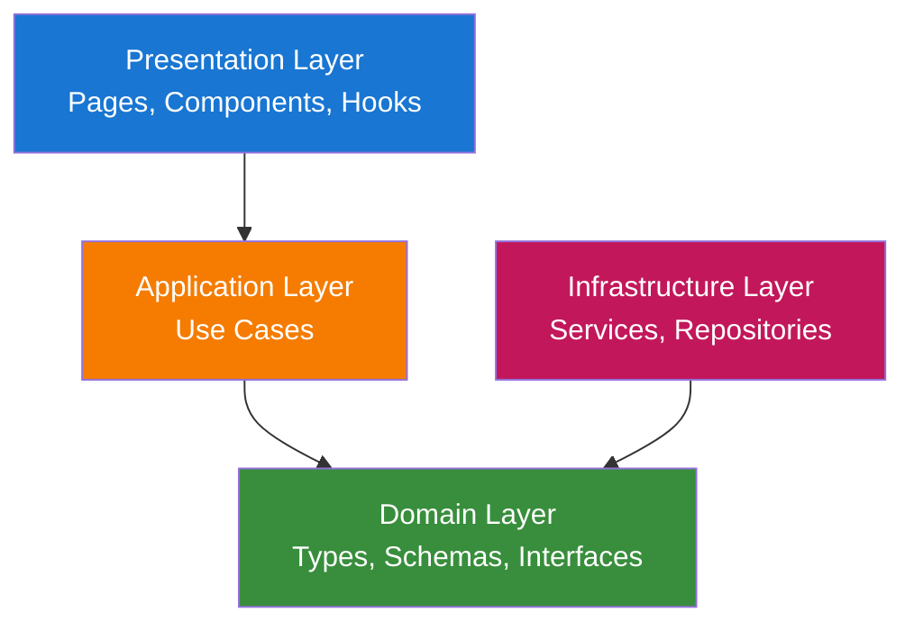
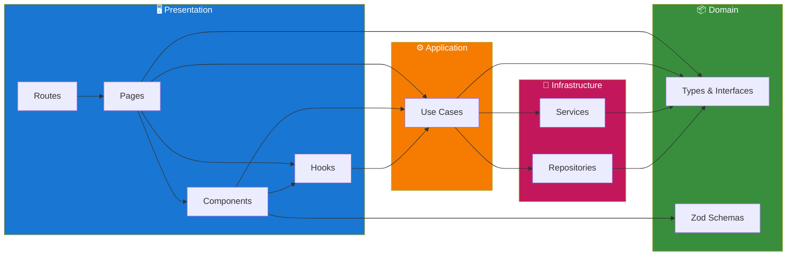
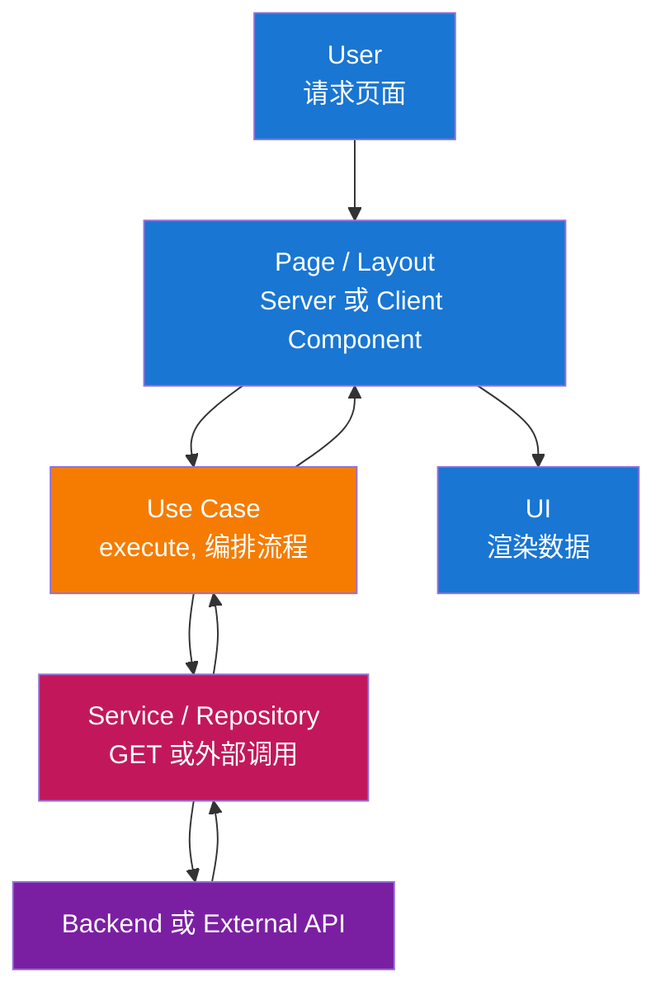
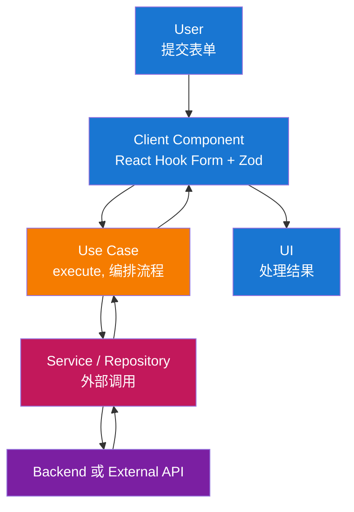
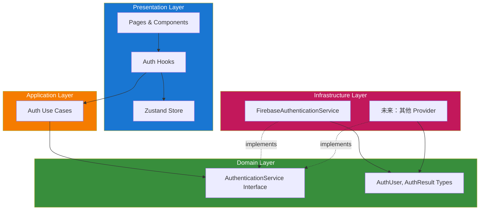

# 架构

本前端遵循 **Clean Architecture** 与 **模块化** 结构。应用易于维护、可测试，并与 Next.js 及所选 UI 技术栈对齐。

## 目录

1. [架构概览](#架构概览)
2. [层级结构](#层级结构)
3. [数据流](#数据流)
4. [层级职责](#层级职责)
   - [Domain Layer](#1-domain-layer-srcmodulesmoduledomain)
   - [Application Layer](#2-application-layer-srcmodulesmoduleapplication)
   - [Infrastructure Layer](#3-infrastructure-layer-srcmodulesmoduleinfrastructure)
   - [Presentation Layer](#4-presentation-layer-srcmodulesmodulepresentation)
5. [模块结构](#模块结构)
6. [关键设计模式](#关键设计模式)
7. [身份验证](#身份验证)
8. [Technology Stack](#technology-stack)

## 架构概览

解决方案按层级组织，实现关注点分离与依赖反转：



**层级说明：**

- **Presentation Layer**：用户交互入口——Next.js 页面、布局与 React components。该层负责渲染 UI 与处理输入，将业务与数据逻辑委托给 application layer。

- **Application Layer**：编排 use case 与应用逻辑——数据获取、表单提交、validation 编排及 domain 规则与 infrastructure 的协调。此处无 UI 与框架细节。

- **Domain Layer**：核心 types、Zod schemas 与 interfaces，供全应用使用。无外部依赖；定义数据形态与 validation 规则（如 API contracts、form payloads）。

- **Infrastructure Layer**：技术实现——services（外部集成如 Firebase）与 repositories（数据访问）。实现 domain layer 定义的 interface。

## 层级结构

包含所有 components 的完整层级结构：



**层级详情：**

| 层级 | 位置 | 内容 |
|------|------|------|
| **Presentation** | `app/`, `presentation/` | Routes, Pages, Components, Hooks |
| **Application** | `application/` | Use Cases |
| **Domain** | `domain/` | types.ts, schemas.ts, interfaces.ts |
| **Infrastructure** | `infrastructure/` | Services, Repositories |

**应用级设置**（非层级）：`src/application/` 包含 `register-container.ts` 和 app config。DI Container utilities 位于 `src/common/utils/container.ts`。

## 数据流

### 读取流（Server 或 Client Page）



### 写入流（表单提交）



## 层级职责

### 1. Domain Layer（`src/modules/{module}/domain/`）

核心 types 与 validation，无外部依赖。共享领域概念可放在模块 domain 或 common interfaces。

**组成：**

- **Types**：API 响应、表单状态及模块概念的 interfaces 与 type aliases（如 `src/modules/auth/domain/types.ts` 中的 auth types）。
- **Zod Schemas**：每模块 `domain/schemas.ts` 中的表单 validation 与 parsing。
- **Constants**：领域相关常量（如路由路径、错误码）在模块内使用。

**原则：**

- 不依赖其他层或框架。
- 仅 types 与 schemas；无 I/O、无 React、无 Next。

### 2. Application Layer（`src/modules/{module}/application/`）

编排 use case 与应用逻辑。Use case 从 DI container 解析；模块通过 `module-configuration.ts` 注册。

**组成：**

- **Use Cases**：`src/modules/{module}/application/` 中的 class（或函数）实现应用流程（如 `sign-in-with-email-use-case.ts`、`update-profile-use-case.ts`）。继承 `src/common/utils/base-use-case.ts` 的 `BaseUseCase`，使用 domain types/schemas，通过 container 依赖 services 或 API client。
- **Module state**：模块级状态（如 Zustand）通过 `src/modules/{module}/presentation/hooks/` 中的 hooks 暴露（如 `use-auth-user-store.ts`）。
- **Data-fetching**：Server 或 Client Components 通过从 container 解析并调用 use case 加载数据。

**原则：**

- 仅依赖 Domain 与 Infrastructure（通过 Awilix 注入）。
- Use case 类中无 UI、无 React；仅编排。

### 3. Infrastructure Layer（`src/modules/{module}/infrastructure/`）

实现技术关注点与外部集成。需要时可有每模块 API client 或 repositories。

**组成：**

- **Services**：`src/modules/{module}/infrastructure/services/` 中的外部集成（如 auth 中的 `firebase-auth-service.ts`）。实现 `src/modules/{module}/domain/interfaces.ts` 中定义的 interface。
- **Repositories**：`src/modules/{module}/infrastructure/repositories/` 中的数据访问实现（如 books 中的 `firestore-book-repository.ts`）。实现 `src/modules/{module}/domain/interfaces.ts` 中定义的 interface。
- **API Client**：当应用与后端 HTTP API 通信时，client 可放在 `src/common/` 或每模块，并在 container 中注册。

**原则：**

- 实现 use case 使用的 interface（通过 container 注入）。
- 所有外部 I/O 与 SDK 使用在此层。

### 4. Presentation Layer（`src/modules/{module}/presentation/`）

处理用户交互并渲染 UI。

**组成：**

- **App Routes**：`app/[locale]/**/page.tsx`（及 route group 如 `(main)`）仅作 routing layer。从 `src/modules/{module}/presentation/pages/` 导入并渲染 page component。
- **Module Pages**：`src/modules/{module}/presentation/pages/{page}/page.tsx` 存放实际 page components。页面可为 Server 或 Client Component；页面专属组件在 `presentation/pages/{page}/components/`。
- **Module Components**：模块共享组件在 `src/modules/{module}/presentation/components/`。
- **Module Hooks**：模块专用 hooks 在 `src/modules/{module}/presentation/hooks/`（如 `use-auth-user-store.ts`、`use-sync-auth-state.ts`）。
- **Common Components**：共享组件在 `src/common/components/`（如 form、input、label、root-layout、main-layout）。仅在需要时使用 `"use client"`（hooks、browser APIs、Zustand）。

**原则：**

- 依赖 Application（通过 container 的 use case）和 Domain（仅 types）。
- 与框架绑定：Next.js App Router、React。业务逻辑保留在 use case 与 services。
- `/app` 仅负责 routing；应用代码均在 `/src`。

## 模块结构

应用以 `/src` 为主源码目录，`/app` 仅作 routing layer。代码按 **module**（功能）组织于 `/src`，共享代码在 `/src/common`。

### 项目结构概览

```text
app/                               # 仅路由层（Next.js App Router）
├── [locale]/                      # 语言段（next-intl）
│   ├── layout.tsx, error.tsx, not-found.tsx
│   ├── (main)/                    # 路由组：主要页面
│   │   ├── page.tsx, docs/, profile/, ...
│   └── auth/                      # Auth 路由
│       ├── sign-in/, sign-up/, forgot-password/
├── globals.css, layout.tsx, not-found.tsx

src/                               # 应用代码均在此
├── __tests__/                     # 测试镜像 src 结构
├── application/                   # 应用级设置
│   ├── components/                # AppInitializer
│   ├── config/                    # firebase-config, main-menu
│   ├── localization/              # request.ts, en.json, vi.json, zh.json
│   └── register-container.ts
├── common/                        # 跨模块共享代码
│   ├── components/                # button, form, main-layout, ...
│   ├── hooks/                     # use-container
│   ├── interfaces.ts              # MenuItem, ResolvedMenuItem
│   ├── pages/                     # error-page, not-found-page
│   ├── routing/                   # routing.ts, navigation.ts
│   └── utils/                     # cn, container, base-use-case, ...
│
├── modules/                       # 功能模块（Clean Architecture）
│   ├── auth/                      # 示例：Auth 模块
│   │   ├── domain/                # types.ts, schemas.ts, interfaces.ts
│   │   ├── application/           # sign-in-use-case.ts, sign-out-use-case.ts, ...
│   │   ├── infrastructure/        # services/firebase-auth-service.ts
│   │   ├── presentation/
│   │   │   ├── components/        # auth-layout, auth-header-slot, ...
│   │   │   ├── hooks/             # use-auth-user-store, use-sync-auth-state
│   │   │   └── pages/             # sign-in/, sign-up/, profile/
│   │   ├── utils/
│   │   └── module-configuration.ts
│   │
│   ├── books/                     # 示例：Books 模块（CRUD）
│   ├── settings/                  # 示例：User settings 模块
│   ├── docs/, landing-page/       # 其他模块
│   │
│   └── {module-name}/             # 模块模板
│       ├── domain/                # types.ts, schemas.ts, interfaces.ts
│       ├── application/           # Use case 文件
│       ├── infrastructure/        # services/, repositories/
│       ├── presentation/          # pages/, components/, hooks/
│       └── module-configuration.ts
```

路由组（如 `(main)`）使用共享 layout 提供带菜单与 auth slot 的 `MainLayout`；auth 路由使用 `AuthLayout`。这样保持 `/app` 最小化，代码集中在 `/src`，便于组织与测试。

详细的路由示例与 patterns 见 [Coding Conventions](./coding-conventions-zh.md)。

## 关键设计模式

### 1. Clean Architecture / Layered Architecture

**目的**：关注点分离与依赖反转（inner layer 不依赖 outer layer）。

**实现：**

- **Domain**：Types、Zod schemas、interfaces——无框架、无 I/O。
- **Application**：Use case（在 `application/`）；仅依赖 Domain 与 Infrastructure interface，经 Awilix 解析。
- **Infrastructure**：Services 与 repositories（在 `infrastructure/`）；实现 domain 的 interface。
- **Presentation**：Pages、components 与 hooks（在 `presentation/`）；依赖 Application 及 Domain types。

**收益：**

- 可测性：应用与领域逻辑可在无 UI、无真实 HTTP 下测试。
- 可维护性：单层变更影响范围小。
- 灵活性：可更换 API client 或认证实现而不改 use case。

### 2. 模块化功能结构

**目的**：将功能（auth、books、docs、landing-page、settings）分组并保持边界清晰。

**实现：**

- 代码均在 `/src`；`/app` 仅负责 routing。
- 按功能在 `src/modules/{feature}/` 分组，含 `domain/`（types、schemas、interfaces）、`application/`（use cases）、`infrastructure/`（services、repositories）、`presentation/`（pages、components、hooks）、`utils/` 及用于 DI 注册的 `module-configuration.ts`。
- 共享代码（components、hooks、routing、utils、container）在 `src/common/`。应用级设置（容器注册、config、localization）在 `src/application/`。

**收益：**

- 职责清晰、易于查找。
- 与后端模块心智模型一致，无需完整 DDD。
- 代码与 routing 分离、use case 经 container 解析，更易测试。

### 3. Dependency Injection（Awilix）

**目的**：从 container 解析 use case 与 services，使 components 解耦且可测。

**实现：**

- Container 在 `src/common/utils/container.ts` 创建，设置 `injectionMode: InjectionMode.PROXY`，在 `src/application/register-container.ts` 注册。
- 各模块在 `module-configuration.ts` 中暴露 `registerModule(container)`，注册 use case 与 services（如 `asFunction(cradle => new SignInWithEmailUseCase(cradle.authService)).singleton()`）。
- Components 通过 `src/common/hooks/use-container.ts` 的 `useContainer()` 解析 use case 并调用 `execute()`。
- 应用级依赖（如 Firebase auth 实例）在 `register-container.ts` 注册。

**收益：**

- Use case 与 services 在测试中可 mock；Server 与 Client Components 共用同一 API。

### 4. API Client / External Services（Infrastructure）

**目的**：集中后端或外部通信，使 use case 独立于 HTTP/SDK 细节。

**实现：**

- 当应用与后端 API 通信时，API client 可放在 `src/common/` 或每模块，并在 container 中注册。使用 domain types 表示 request/response。
- 外部集成（如 Firebase）在 `src/modules/{module}/infrastructure/services/`，实现 `src/modules/{module}/domain/interfaces.ts` 中的 interface。Use case 依赖这些 interface，经 container 接收实现。

**收益：**

- 测试中易 mock，可更换后端 URL 或实现。

### 5. Zod Validation 与 Types

**目的**：validation 与 inferred types 的单一来源。

**实现：**

- 每模块 Zod schemas 在 `src/modules/{module}/domain/schemas.ts`。
- 通过 `zodResolver(schema)` 与 React Hook Form 配合。
- 使用 `z.infer<typeof schema>` 导出 types。

**收益：**

- 客户端 validation 一致；由 schemas 得到 type safety。

### 6. Infrastructure Interfaces

**目的**：use case 与外部服务间松耦合。

**实现：**

- Interface（如 `AuthenticationService`）在 `src/modules/{module}/domain/interfaces.ts`。Use case 依赖这些 interface；实现（如 `FirebaseAuthenticationService`）在 `infrastructure/services/` 并在 container 中注册。

**收益：**

- 单元测试更简单，可替换实现（如测试中 mock auth）。

## 身份验证

本项目使用**抽象化身份验证**，允许在不修改 application 或 presentation 代码的情况下更换底层 provider。Firebase Auth 是当前的实现，用于快速 MVP 开发。

### 身份验证架构



### 工作原理

1. **Domain Interface**：`src/modules/auth/domain/interfaces.ts` 中的 `AuthenticationService` 定义所有 auth 操作的契约（登录、注册、登出、密码重置等）

2. **Domain Types**：`src/modules/auth/domain/types.ts` 中的 `AuthUser`、`AuthResult`、`AuthErrorCode` 与 provider 无关

3. **Infrastructure Implementation**：`FirebaseAuthenticationService` 实现 interface 并将 Firebase 特定的 types/errors 映射到 domain types

4. **Dependency Injection**：Service 在 DI container 中注册并注入到 use cases

5. **State Management**：`useAuthUserStore`（Zustand）保存当前用户状态，通过 `useSyncAuthState` hook 同步

### 更换 Authentication Provider

要从 Firebase 切换到其他 provider（如 Auth0、Supabase、自建后端）：

1. 创建新 service 实现 `AuthenticationService` interface
2. 更新 `module-configuration.ts` 注册新 service
3. 无需修改 use cases、pages 或 components

```typescript
// 示例：新 provider 实现
export class Auth0AuthenticationService implements AuthenticationService {
  async signInWithEmail(email: string, password: string): Promise<AuthResult> {
    // Auth0 实现
  }
  // ... 其他方法
}
```

这种抽象使代码库**适合 MVP**（使用 Firebase 快速迭代）同时保持**生产就绪**（易于迁移到企业级认证方案）。

详细的 Firebase 设置与配置，请参阅 [Firebase 集成](./firebase-integration-zh.md)。

## Technology Stack

| 类别 | 技术 |
|------|------|
| **Framework** | Next.js（App Router）、React |
| **语言** | TypeScript（strict mode） |
| **UI** | shadcn 风格组件（Radix UI + Tailwind CSS） |
| **State** | Zustand（仅客户端状态） |
| **Forms** | React Hook Form + Zod |
| **i18n** | next-intl |
| **DI** | Awilix |
| **Auth** | Firebase（可选） |
| **Testing** | Vitest、React Testing Library |
