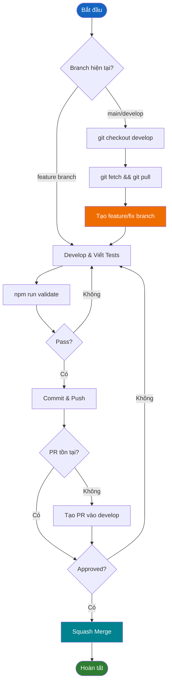

# Development Guide

Hướng dẫn này mô tả từng bước thêm tính năng mới và tạo module mới theo các pattern Clean Architecture.

## Mục lục

1. [Git Workflow](#git-workflow)
   - [Development Workflow](#development-workflow)
   - [Branch Naming](#branch-naming)
2. [Thêm tính năng mới](#thêm-tính-năng-mới)
   - [Bước 1: Xác định Module](#bước-1-xác-định-module)
   - [Bước 2: Tạo Domain Types](#bước-2-tạo-domain-types-nếu-cần)
   - [Bước 3: Tạo Use Case](#bước-3-tạo-use-case)
   - [Bước 4: Đăng ký Use Case](#bước-4-đăng-ký-use-case)
   - [Bước 5: Tạo UI Components](#bước-5-tạo-ui-components)
   - [Bước 6: Thêm Route](#bước-6-thêm-route)
   - [Bước 7: Viết Tests](#bước-7-viết-tests)
3. [Tạo Module mới](#tạo-module-mới)
   - [Cấu trúc Module](#cấu-trúc-module)
   - [Từng bước](#từng-bước)
4. [Common Patterns](#common-patterns)
   - [Use Case Pattern](#use-case-pattern)
   - [Form với Validation](#form-với-validation)
   - [Interface Implementation](#interface-implementation)
5. [Testing](#testing)

## Git Workflow

### Development Workflow



### Các bước Workflow

#### Bắt đầu công việc mới

1. **Tạo Feature/Fix Branch**
   ```bash
   git checkout develop
   git fetch origin && git pull origin develop
   git checkout -b feature/your-feature-name   # hoặc fix/your-bug-fix
   ```

#### Tiếp tục công việc hiện tại

1. **Nếu đã ở feature branch**, tiếp tục develop trực tiếp.

#### Chu kỳ Development

2. **Develop và Validate**
   ```bash
   # Thực hiện thay đổi, viết tests
   npm run validate  # Phải pass trước khi commit (lint + format + tests với 100% coverage)
   ```

3. **Commit và Push**
   ```bash
   git add . && git commit -m "feat: mô tả"
   git push -u origin feature/your-feature-name
   ```

4. **Tạo PR** vào branch `develop` (nếu chưa tạo), sau đó squash merge khi được approve.

### Branch Naming

| Loại | Pattern | Ví dụ |
|------|---------|-------|
| Tính năng mới | `feature/description` | `feature/add-user-profile` |
| Sửa lỗi | `fix/description` | `fix/login-validation` |
| Hotfix | `hotfix/description` | `hotfix/security-patch` |

## Thêm tính năng mới

### Bước 1: Xác định Module

Xác định module chứa tính năng:
- `settings` - Cài đặt người dùng
- `landing-page` - Trang công khai
- Hoặc tạo module mới (xem [Tạo Module mới](#tạo-module-mới))

### Bước 2: Tạo Domain Types (nếu cần)

Thêm types và schemas trong `src/modules/{module}/domain/`:

```typescript
// domain/types.ts
export type NewFeatureData = {
  id: string;
  name: string;
};

// domain/schemas.ts
import { z } from "zod";

export const newFeatureSchema = z.object({
  name: z.string().min(1, "Tên là bắt buộc"),
});

export type NewFeatureInput = z.infer<typeof newFeatureSchema>;
```

### Bước 3: Tạo Use Case

Thêm use case trong `src/modules/{module}/application/`:

```typescript
// application/create-feature-use-case.ts
import { BaseUseCase } from "@/common/utils/base-use-case";
import type { FeatureRepository } from "@/modules/{module}/domain/interfaces";

type Input = { userId: string; data: NewFeatureInput };
type Output = { success: boolean };

export class CreateFeatureUseCase extends BaseUseCase<Input, Output> {
  constructor(private readonly repository: FeatureRepository) {
    super();
  }

  async execute(input: Input): Promise<Output> {
    await this.repository.create(input.userId, input.data);
    return { success: true };
  }
}
```

### Bước 4: Đăng ký Use Case

Cập nhật `src/modules/{module}/module-configuration.ts`:

```typescript
import { asFunction } from "awilix";
import { CreateFeatureUseCase } from "./application/create-feature-use-case";

export function registerModule(container: AwilixContainer<object>): void {
  container.register({
    createFeatureUseCase: asFunction(
      (cradle) => new CreateFeatureUseCase(cradle.featureRepository)
    ).singleton(),
  });
}
```

### Bước 5: Tạo UI Components

Thêm page trong `src/modules/{module}/presentation/pages/{page}/`:

```typescript
// presentation/pages/new-feature/page.tsx
"use client";

import { useContainer } from "@/common/hooks/use-container";

export function NewFeaturePage() {
  const { createFeatureUseCase } = useContainer();
  // ... logic component
}
```

### Bước 6: Thêm Route

Tạo route trong `app/[locale]/`:

```typescript
// app/[locale]/(main)/new-feature/page.tsx
import { NewFeaturePage } from "@/modules/{module}/presentation/pages/new-feature/page";

export default function Page() {
  return <NewFeaturePage />;
}
```

### Bước 7: Viết Tests

Thêm tests trong `src/__tests__/modules/{module}/`:

```typescript
// __tests__/modules/{module}/application/create-feature-use-case.test.ts
describe("CreateFeatureUseCase", () => {
  it("tạo feature thành công", async () => {
    // ... implementation test
  });
});
```

## Tạo Module mới

### Cấu trúc Module

```text
src/modules/{module-name}/
├── domain/
│   ├── types.ts              # Domain types
│   ├── schemas.ts            # Zod validation schemas
│   └── interfaces.ts         # Service/Repository interfaces
├── application/
│   └── {use-case}-use-case.ts
├── infrastructure/
│   ├── services/             # Triển khai external service
│   └── repositories/         # Triển khai data access
├── presentation/
│   ├── components/           # Components dùng chung module
│   ├── hooks/                # Module hooks (Zustand stores, v.v.)
│   └── pages/
│       └── {page}/
│           ├── page.tsx
│           └── components/   # Components riêng trang
├── utils/                    # Utilities module
└── module-configuration.ts   # Đăng ký DI
```

### Từng bước

1. **Tạo cấu trúc folder** theo template trên

2. **Định nghĩa domain** (`domain/types.ts`, `domain/schemas.ts`, `domain/interfaces.ts`)

3. **Triển khai infrastructure** (services/repositories implement interfaces)

4. **Tạo use cases** trong `application/`

5. **Đăng ký vào DI container** (`module-configuration.ts`):
   ```typescript
   export function registerModule(container: AwilixContainer<object>): void {
     container.register({
       // Đăng ký services/repositories
       featureRepository: asFunction(
         (cradle) => new FeatureRepository(cradle.service)
       ).singleton(),
       // Đăng ký use cases
       createFeatureUseCase: asFunction(
         (cradle) => new CreateFeatureUseCase(cradle.featureRepository)
       ).singleton(),
     });
   }
   ```

6. **Đăng ký module** trong `src/application/register-container.ts`:
   ```typescript
   import { registerModule as registerFeatureModule } from "@/modules/feature/module-configuration";
   
   export function registerContainer(container: AwilixContainer<object>): void {
     // ... đăng ký hiện có
     registerFeatureModule(container);
   }
   ```

7. **Tạo presentation layer** (pages, components, hooks)

8. **Thêm routes** trong `app/[locale]/`

9. **Viết tests** phản chiếu cấu trúc module trong `src/__tests__/`

## Common Patterns

### Use Case Pattern

```typescript
export class MyUseCase extends BaseUseCase<Input, Output> {
  constructor(private readonly service: ServiceInterface) {
    super();
  }

  async execute(input: Input): Promise<Output> {
    // Điều phối luồng
    return this.service.doSomething(input);
  }
}
```

### Form với Validation

```typescript
const form = useForm<FormData>({
  resolver: zodResolver(formSchema),
  defaultValues: { name: "" },
});

const onSubmit = async (data: FormData) => {
  await useCase.execute(data);
};
```

### Resolve Use Cases

```typescript
// Trong components
const { myUseCase } = useContainer();
await myUseCase.execute(input);
```

### Interface Implementation

```typescript
// domain/interfaces.ts
export interface FeatureRepository {
  create(userId: string, data: FeatureData): Promise<void>;
  get(userId: string, id: string): Promise<Feature | null>;
}

// infrastructure/repositories/feature-repository.ts
export class FeatureRepository implements FeatureRepository {
  // Implementation
}
```

## Testing

### Tham khảo nhanh

| Lệnh | Mục đích |
|------|----------|
| `npm test` | Chạy tất cả tests |
| `npm run test:coverage` | Chạy với báo cáo coverage |
| `npm run validate` | Validation đầy đủ (bao gồm tests) |

### Điểm chính

- **100% code coverage** là bắt buộc
- Tests phản chiếu cấu trúc source trong `src/__tests__/`
- Mock services/repositories tại boundary
