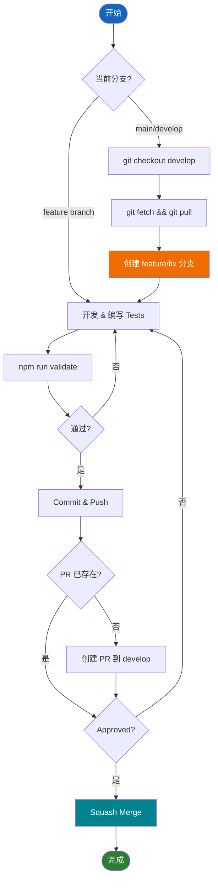

# Development Guide

本指南提供按 Clean Architecture patterns 添加新功能和创建新模块的分步说明。

## 目录

1. [Git Workflow](#git-workflow)
   - [Development Workflow](#development-workflow)
   - [Branch Naming](#branch-naming)
2. [添加新功能](#添加新功能)
   - [步骤 1：确定 Module](#步骤-1确定-module)
   - [步骤 2：创建 Domain Types](#步骤-2创建-domain-types如需要)
   - [步骤 3：创建 Use Case](#步骤-3创建-use-case)
   - [步骤 4：注册 Use Case](#步骤-4注册-use-case)
   - [步骤 5：创建 UI Components](#步骤-5创建-ui-components)
   - [步骤 6：添加 Route](#步骤-6添加-route)
   - [步骤 7：编写 Tests](#步骤-7编写-tests)
3. [创建新 Module](#创建新-module)
   - [Module 结构](#module-结构)
   - [分步说明](#分步说明)
4. [Common Patterns](#common-patterns)
   - [Use Case Pattern](#use-case-pattern)
   - [Form 与 Validation](#form-与-validation)
   - [Interface Implementation](#interface-implementation)
5. [Testing](#testing)

## Git Workflow

### Development Workflow



### Workflow 步骤

#### 开始新工作

1. **创建 Feature/Fix Branch**
   ```bash
   git checkout develop
   git fetch origin && git pull origin develop
   git checkout -b feature/your-feature-name   # 或 fix/your-bug-fix
   ```

#### 继续现有工作

1. **如果已在 feature branch**，直接继续开发。

#### 开发周期

2. **开发与 Validate**
   ```bash
   # 修改代码，编写 tests
   npm run validate  # 提交前必须通过（lint + format + tests 100% coverage）
   ```

3. **Commit 与 Push**
   ```bash
   git add . && git commit -m "feat: 描述"
   git push -u origin feature/your-feature-name
   ```

4. **创建 PR** 到 `develop` 分支（如尚未创建），approve 后 squash merge。

### Branch Naming

| 类型 | Pattern | 示例 |
|------|---------|------|
| 新功能 | `feature/description` | `feature/add-user-profile` |
| 修复 | `fix/description` | `fix/login-validation` |
| Hotfix | `hotfix/description` | `hotfix/security-patch` |

## 添加新功能

### 步骤 1：确定 Module

确定功能所属的 module：
- `auth` - 认证功能
- `books` - 图书 CRUD 操作
- `settings` - 用户设置
- `landing-page` - 公开页面
- 或创建新 module（见 [创建新 Module](#创建新-module)）

### 步骤 2：创建 Domain Types（如需要）

在 `src/modules/{module}/domain/` 中添加 types 和 schemas：

```typescript
// domain/types.ts
export type NewFeatureData = {
  id: string;
  name: string;
};

// domain/schemas.ts
import { z } from "zod";

export const newFeatureSchema = z.object({
  name: z.string().min(1, "名称必填"),
});

export type NewFeatureInput = z.infer<typeof newFeatureSchema>;
```

### 步骤 3：创建 Use Case

在 `src/modules/{module}/application/` 中添加 use case：

```typescript
// application/create-feature-use-case.ts
import { BaseUseCase } from "@/common/utils/base-use-case";
import type { FeatureRepository } from "@/modules/{module}/domain/interfaces";

type Input = { userId: string; data: NewFeatureInput };
type Output = { success: boolean };

export class CreateFeatureUseCase extends BaseUseCase<Input, Output> {
  constructor(private readonly repository: FeatureRepository) {
    super();
  }

  async execute(input: Input): Promise<Output> {
    await this.repository.create(input.userId, input.data);
    return { success: true };
  }
}
```

### 步骤 4：注册 Use Case

更新 `src/modules/{module}/module-configuration.ts`：

```typescript
import { asFunction } from "awilix";
import { CreateFeatureUseCase } from "./application/create-feature-use-case";

export function registerModule(container: AwilixContainer<object>): void {
  container.register({
    createFeatureUseCase: asFunction(
      (cradle) => new CreateFeatureUseCase(cradle.featureRepository)
    ).singleton(),
  });
}
```

### 步骤 5：创建 UI Components

在 `src/modules/{module}/presentation/pages/{page}/` 中添加 page：

```typescript
// presentation/pages/new-feature/page.tsx
"use client";

import { useContainer } from "@/common/hooks/use-container";

export function NewFeaturePage() {
  const { createFeatureUseCase } = useContainer();
  // ... component 逻辑
}
```

### 步骤 6：添加 Route

在 `app/[locale]/` 中创建 route：

```typescript
// app/[locale]/(main)/new-feature/page.tsx
import { NewFeaturePage } from "@/modules/{module}/presentation/pages/new-feature/page";

export default function Page() {
  return <NewFeaturePage />;
}
```

### 步骤 7：编写 Tests

在 `src/__tests__/modules/{module}/` 中添加 tests：

```typescript
// __tests__/modules/{module}/application/create-feature-use-case.test.ts
describe("CreateFeatureUseCase", () => {
  it("成功创建 feature", async () => {
    // ... test implementation
  });
});
```

## 创建新 Module

### Module 结构

```text
src/modules/{module-name}/
├── domain/
│   ├── types.ts              # Domain types
│   ├── schemas.ts            # Zod validation schemas
│   └── interfaces.ts         # Service/Repository interfaces
├── application/
│   └── {use-case}-use-case.ts
├── infrastructure/
│   ├── services/             # 外部服务实现
│   └── repositories/         # 数据访问实现
├── presentation/
│   ├── components/           # 模块共享组件
│   ├── hooks/                # 模块 hooks（Zustand stores 等）
│   └── pages/
│       └── {page}/
│           ├── page.tsx
│           └── components/   # 页面专属组件
├── utils/                    # 模块工具
└── module-configuration.ts   # DI 注册
```

### 分步说明

1. **按上述模板创建目录结构**

2. **定义 domain**（`domain/types.ts`、`domain/schemas.ts`、`domain/interfaces.ts`）

3. **实现 infrastructure**（services/repositories 实现 interfaces）

4. **创建 use cases** 在 `application/`

5. **注册到 DI container**（`module-configuration.ts`）：
   ```typescript
   export function registerModule(container: AwilixContainer<object>): void {
     container.register({
       // 注册 services/repositories
       featureRepository: asFunction(
         (cradle) => new FirestoreFeatureRepository(cradle.getFirestoreInstance)
       ).singleton(),
       // 注册 use cases
       createFeatureUseCase: asFunction(
         (cradle) => new CreateFeatureUseCase(cradle.featureRepository)
       ).singleton(),
     });
   }
   ```

6. **在 `src/application/register-container.ts` 中注册 module**：
   ```typescript
   import { registerModule as registerFeatureModule } from "@/modules/feature/module-configuration";
   
   export function registerContainer(container: AwilixContainer<object>): void {
     // ... 现有注册
     registerFeatureModule(container);
   }
   ```

7. **创建 presentation layer**（pages、components、hooks）

8. **添加 routes** 在 `app/[locale]/`

9. **编写 tests** 在 `src/__tests__/` 中镜像 module 结构

## Common Patterns

### Use Case Pattern

```typescript
export class MyUseCase extends BaseUseCase<Input, Output> {
  constructor(private readonly service: ServiceInterface) {
    super();
  }

  async execute(input: Input): Promise<Output> {
    // 编排流程
    return this.service.doSomething(input);
  }
}
```

### Form 与 Validation

```typescript
const form = useForm<FormData>({
  resolver: zodResolver(formSchema),
  defaultValues: { name: "" },
});

const onSubmit = async (data: FormData) => {
  await useCase.execute(data);
};
```

### 解析 Use Cases

```typescript
// 在 components 中
const { myUseCase } = useContainer();
await myUseCase.execute(input);
```

### Interface Implementation

```typescript
// domain/interfaces.ts
export interface FeatureRepository {
  create(userId: string, data: FeatureData): Promise<void>;
  get(userId: string, id: string): Promise<Feature | null>;
}

// infrastructure/repositories/firestore-feature-repository.ts
export class FirestoreFeatureRepository implements FeatureRepository {
  // Implementation
}
```

## Testing

### 快速参考

| 命令 | 用途 |
|------|------|
| `npm test` | 运行所有 tests |
| `npm run test:coverage` | 运行并生成 coverage 报告 |
| `npm run validate` | 完整 validation（包含 tests） |

### 要点

- **100% code coverage** 为必需
- Tests 在 `src/__tests__/` 中镜像源码结构
- 在边界处 mock services/repositories
