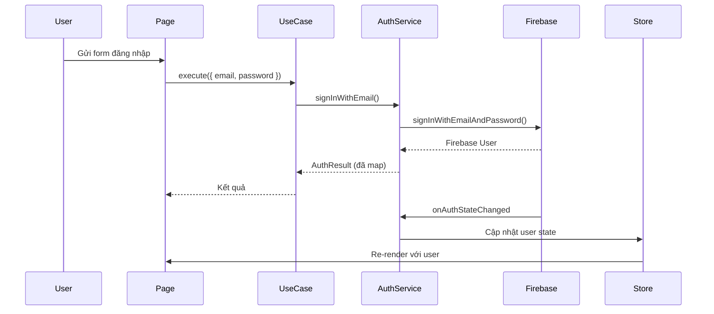
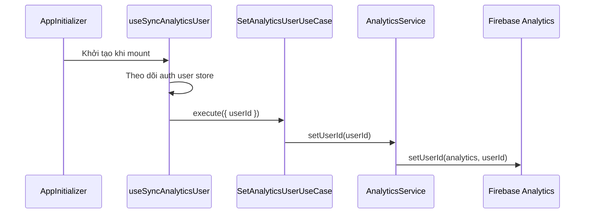

# Tích hợp Firebase

Dự án này sử dụng Firebase cho xác thực, lưu trữ dữ liệu và phân tích. Firebase được chọn để **phát triển MVP nhanh chóng** trong khi kiến trúc đảm bảo dễ dàng migrate sang provider khác khi cần.

## Mục lục

1. [Tổng quan](#tổng-quan)
2. [Cấu hình](#cấu-hình)
3. [Xác thực](#xác-thực)
4. [Phân tích](#phân-tích)
5. [Firestore Database](#firestore-database)
6. [Security Rules](#security-rules)
7. [Thay đổi Provider](#thay-đổi-provider)

## Tổng quan

Firebase cung cấp ba dịch vụ cốt lõi trong dự án này:

| Dịch vụ | Mục đích | Trừu tượng hóa |
|---------|----------|----------------|
| **Firebase Auth** | Xác thực người dùng (email/password, Google) | Interface `AuthenticationService` |
| **Firebase Analytics** | Theo dõi sự kiện, page views, nhận diện người dùng | Interface `AnalyticsService` |
| **Firestore** | NoSQL document database | Các interface Repository theo module |

### Tại sao Firebase cho MVP?

- **Không cần setup backend**: Xác thực và database sẵn sàng trong vài phút
- **Free tier hào phóng**: Phù hợp phát triển và production quy mô nhỏ
- **Khả năng real-time**: Tích hợp sẵn real-time listeners
- **Dễ tích hợp**: SDK chính thức với hỗ trợ TypeScript

### Tại sao cần trừu tượng hóa

Dự án trừu tượng hóa Firebase sau domain interfaces, cho phép:

- **Thay đổi provider**: Chuyển sang Auth0, Supabase hoặc backend tự xây mà không đổi code application
- **Testing**: Mock services dễ dàng trong unit tests
- **Migration từng phần**: Thay từng service một (vd. giữ Auth, đổi Firestore)

## Cấu hình

### Thiết lập môi trường

Cấu hình Firebase được lưu dạng JSON string trong biến môi trường:

```bash
# .env.local
NEXT_PUBLIC_FIREBASE_CONFIG='{"apiKey":"...","authDomain":"...","projectId":"...","storageBucket":"...","messagingSenderId":"...","appId":"..."}'
```

### Module Firebase Config

**Vị trí**: `src/application/config/firebase-config.ts`

```typescript
// Pattern Singleton cho Firebase instances
export function getAuthInstance(): Auth | null {
  if (typeof window === "undefined") return null;
  // Trả về Auth instance đã cache hoặc khởi tạo mới
}

export function getFirestoreInstance(): Firestore | null {
  if (typeof window === "undefined") return null;
  // Trả về Firestore instance đã cache hoặc khởi tạo mới
}

export function getAnalyticsInstance(): Analytics | null {
  if (typeof window === "undefined") return null;
  // Trả về Analytics instance đã cache (khởi tạo sớm cùng Firebase app)
}
```

**Đặc điểm chính:**

- **Chỉ client**: Trả về `null` ở server (SSR-safe)
- **Singleton**: Cache instances để tránh khởi tạo nhiều lần
- **Lazy initialization**: Chỉ khởi tạo khi truy cập lần đầu

### Đăng ký DI Container

**Vị trí**: `src/application/register-container.ts`

```typescript
container.register({
  getAnalyticsInstance: asValue(getAnalyticsInstance),
  getAuthInstance: asValue(getAuthInstance),
  getFirestoreInstance: asValue(getFirestoreInstance),
});
```

Services nhận các factory function này, không phải Firebase instances trực tiếp, giúp dễ testing và thay đổi.

## Xác thực

### Domain Interface

**Vị trí**: `src/modules/auth/domain/interfaces.ts`

```typescript
export interface AuthenticationService {
  signInWithGoogle(): Promise<AuthResult>;
  signInWithEmail(email: string, password: string): Promise<AuthResult>;
  signUpWithEmail(email: string, password: string, displayName?: string): Promise<AuthResult>;
  sendPasswordReset(email: string): Promise<AuthResult>;
  signOut(): Promise<void>;
  subscribeToAuthState(callback: (user: AuthUser | null) => void): () => void;
  updateDisplayName(displayName: string): Promise<AuthResult>;
  updatePassword(oldPassword: string, newPassword: string): Promise<AuthResult>;
}
```

### Domain Types

**Vị trí**: `src/modules/auth/domain/types.ts`

```typescript
export interface AuthUser {
  id: string;
  email: string | null;
  displayName: string | null;
  photoUrl: string | null;
  authType: AuthType;
}

export type AuthType = "email" | "google" | "apple" | "other";

export interface AuthResult {
  success: boolean;
  user?: AuthUser;
  errorCode?: AuthErrorCode;
}

export type AuthErrorCode =
  | "invalid-credentials"
  | "email-already-in-use"
  | "weak-password"
  | "user-not-found"
  | "wrong-password"
  | "requires-recent-login"
  | "unknown";
```

### Firebase Implementation

**Vị trí**: `src/modules/auth/infrastructure/services/firebase-auth-service.ts`

Class `FirebaseAuthenticationService`:

1. **Implement** interface `AuthenticationService`
2. **Nhận** function `GetAuthInstance` qua dependency injection
3. **Map** Firebase user sang domain `AuthUser`
4. **Map** Firebase errors sang domain `AuthErrorCode`

```typescript
export class FirebaseAuthenticationService implements AuthenticationService {
  constructor(private getAuthInstance: GetAuthInstance) {}

  async signInWithEmail(email: string, password: string): Promise<AuthResult> {
    const auth = this.getAuthInstance();
    if (!auth) return { success: false, errorCode: "unknown" };

    try {
      const result = await signInWithEmailAndPassword(auth, email, password);
      return { success: true, user: this.mapUser(result.user) };
    } catch (error) {
      return { success: false, errorCode: mapAuthErrorCode(error) };
    }
  }

  // ... các method khác
}
```

### Quản lý Auth State

**Zustand Store**: `src/modules/auth/presentation/hooks/use-auth-user-store.ts`

```typescript
interface AuthUserStore {
  user: AuthUser | null;
  loading: boolean;
  setAuthState: (user: AuthUser | null, loading: boolean) => void;
}
```

**Sync Hook**: `src/modules/auth/presentation/hooks/use-sync-auth-state.ts`

- Subscribe vào thay đổi auth state khi mount
- Cập nhật Zustand store khi user đăng nhập/đăng xuất
- Cleanup subscription khi unmount

**Khởi tạo**: `src/application/components/app-initializer.tsx`

```typescript
export function AppInitializer() {
  useSyncAuthState();      // Bắt đầu đồng bộ auth state
  useSyncUserSettings();   // Đồng bộ user preferences
  useSyncAnalyticsUser();  // Đồng bộ analytics user ID
  return null;
}
```

### Luồng xác thực



## Phân tích

Module analytics theo dõi hành vi người dùng qua Firebase Analytics, tuân theo cùng pattern Clean Architecture như các module khác.

### Domain Interface

**Vị trí**: `src/modules/analytics/domain/interfaces.ts`

```typescript
export interface AnalyticsService {
  logEvent(eventName: string, params?: Record<string, unknown>): void;
  setUserId(userId: string | null): void;
}
```

### Firebase Implementation

**Vị trí**: `src/modules/analytics/infrastructure/services/firebase-analytics-service.ts`

Class `FirebaseAnalyticsService`:

1. **Implement** interface `AnalyticsService`
2. **Nhận** function `GetAnalyticsInstance` qua dependency injection
3. **Delegate** tới `logEvent` và `setUserId` của Firebase SDK
4. **Xử lý graceful** khi analytics instance không có (return im lặng)

```typescript
export class FirebaseAnalyticsService implements AnalyticsService {
  constructor(private readonly getAnalyticsInstance: GetAnalyticsInstance) {}

  logEvent(eventName: string, params?: Record<string, unknown>): void {
    const analytics = this.getAnalyticsInstance();
    if (!analytics) return;
    firebaseLogEvent(analytics, eventName, params);
  }

  setUserId(userId: string | null): void {
    const analytics = this.getAnalyticsInstance();
    if (!analytics) return;
    firebaseSetUserId(analytics, userId);
  }
}
```

### Use Cases

**Vị trí**: `src/modules/analytics/application/`

| Use Case | Mục đích |
|----------|----------|
| `LogEventUseCase` | Ghi custom analytics events với optional parameters |
| `SetAnalyticsUserUseCase` | Đặt hoặc xóa analytics user ID |

```typescript
// Ghi custom event
await logEventUseCase.execute({
  eventName: "button_click",
  params: { button_id: "cta_signup" },
});

// Đặt user ID cho user đã xác thực
await setAnalyticsUserUseCase.execute({ userId: "uid-123" });

// Xóa user ID khi đăng xuất
await setAnalyticsUserUseCase.execute({ userId: null });
```

### Theo dõi Page View tự động

Page views được theo dõi tự động bởi GA4 Enhanced Measurement. Khi GA4 property bật "Page changes based on browser history events" (mặc định), event `page_view` được gửi tự động mỗi khi Next.js thực hiện navigation client-side qua History API (`pushState`/`replaceState`). Không cần custom hook.

### Hook đồng bộ User ID

**Vị trí**: `src/modules/analytics/presentation/hooks/use-sync-analytics-user.ts`

Được khởi tạo trong `AppInitializer`, hook này:

- Theo dõi auth user từ `useAuthUserStore`
- Đặt Firebase Analytics user ID khi user đăng nhập
- Xóa user ID khi user đăng xuất

### Luồng Analytics



### Module Configuration

**Vị trí**: `src/modules/analytics/module-configuration.ts`

```typescript
export function registerModule(container: AwilixContainer<object>): void {
  container.register({
    analyticsService: asFunction(
      (c) => new FirebaseAnalyticsService(c.getAnalyticsInstance),
    ).singleton(),
    logEventUseCase: asFunction(
      (c) => new LogEventUseCase(c.analyticsService),
    ).singleton(),
    setAnalyticsUserUseCase: asFunction(
      (c) => new SetAnalyticsUserUseCase(c.analyticsService),
    ).singleton(),
  });
}
```

### Ghi Custom Events

Để ghi custom events từ bất kỳ client component nào:

```typescript
"use client";

import { useContainer } from "@/common/hooks/use-container";
import type { LogEventUseCase } from "@/modules/analytics/application/log-event-use-case";

export function MyComponent() {
  const container = useContainer();

  const handleClick = () => {
    const logEventUseCase = container.resolve("logEventUseCase") as LogEventUseCase;
    logEventUseCase.execute({
      eventName: "feature_used",
      params: { feature: "export_pdf" },
    });
  };

  return <button onClick={handleClick}>Export</button>;
}
```

## Firestore Database

### Repository Pattern

Mỗi module cần lưu trữ dữ liệu định nghĩa repository interface trong domain layer.

**Ví dụ - Module Books**

**Interface**: `src/modules/books/domain/interfaces.ts`

```typescript
export interface BookRepository {
  find(userId: string, params: BookSearchParams): Promise<BookSearchResult>;
  get(userId: string, bookId: string): Promise<Book | null>;
  create(userId: string, book: CreateBookData): Promise<Book>;
  update(userId: string, bookId: string, book: UpdateBookData): Promise<Book | null>;
  delete(userId: string, bookId: string): Promise<boolean>;
}
```

**Implementation**: `src/modules/books/infrastructure/repositories/firestore-book-repository.ts`

### Cấu trúc dữ liệu

```
Firestore
├── users/{userId}
│   └── books/{bookId}
│       ├── title: string
│       ├── author: string
│       ├── searchText: string (đã normalize cho search)
│       ├── createdAt: number (epoch ms)
│       ├── updatedAt: number (epoch ms)
│       └── createdBy: string
│
└── user-settings/{userId}
    ├── theme: string
    └── language: string
```

### Tính năng

**Cô lập dữ liệu người dùng**: Dữ liệu mỗi user được lưu trong subcollection riêng (`users/{userId}/books`)

**Phân trang**: Phân trang dựa trên cursor sử dụng `startAfter` của Firestore

```typescript
async find(userId: string, params: BookSearchParams): Promise<BookSearchResult> {
  // Build query với ordering và pagination
  let q = query(
    collection(db, `users/${userId}/books`),
    orderBy("title"),
    limit(params.pageSize + 1) // Lấy thêm 1 để check hasMore
  );

  if (params.cursor) {
    q = query(q, startAfter(params.cursor));
  }

  // Execute và map kết quả
}
```

**Tìm kiếm**: Sử dụng field `searchText` đã normalize cho tìm kiếm text đơn giản

**Timestamps**: Lưu dạng epoch milliseconds để nhất quán

## Security Rules

**Vị trí**: `firestore.rules`

```javascript
rules_version = '2';
service cloud.firestore {
  match /databases/{database}/documents {
    // Mặc định từ chối
    match /{document=**} {
      allow read, write: if false;
    }

    // User settings - users chỉ truy cập được của mình
    match /user-settings/{userId} {
      allow read, write: if request.auth != null && request.auth.uid == userId;
    }

    // Books - users chỉ truy cập được books của mình
    match /users/{userId}/books/{bookId} {
      allow read, delete: if request.auth != null && request.auth.uid == userId;
      allow create, update: if request.auth != null
        && request.auth.uid == userId
        && request.resource.data.createdBy == request.auth.uid;
    }
  }
}
```

**Nguyên tắc chính:**

- Mặc định từ chối mọi truy cập
- Users chỉ đọc/ghi được dữ liệu của mình
- Thao tác ghi validate `createdBy` khớp với user đã xác thực

## Thay đổi Provider

Kiến trúc trừu tượng hóa giúp thay đổi Firebase sang provider khác dễ dàng.

### Thay đổi Authentication

1. **Tạo service mới** implement `AuthenticationService`:

```typescript
// src/modules/auth/infrastructure/services/auth0-auth-service.ts
export class Auth0AuthenticationService implements AuthenticationService {
  async signInWithEmail(email: string, password: string): Promise<AuthResult> {
    // Implementation Auth0
  }
  // ... implement tất cả interface methods
}
```

2. **Cập nhật module configuration**:

```typescript
// src/modules/auth/module-configuration.ts
container.register({
  authService: asFunction(
    (cradle) => new Auth0AuthenticationService(cradle.auth0Client)
  ).singleton(),
});
```

3. **Không cần thay đổi** use cases, pages hay components

### Thay đổi Database

1. **Tạo repository mới** implement interface:

```typescript
// src/modules/books/infrastructure/repositories/postgres-book-repository.ts
export class PostgresBookRepository implements BookRepository {
  async find(userId: string, params: BookSearchParams): Promise<BookSearchResult> {
    // Implementation PostgreSQL
  }
  // ... implement tất cả interface methods
}
```

2. **Cập nhật module configuration**:

```typescript
// src/modules/books/module-configuration.ts
container.register({
  bookRepository: asFunction(
    (cradle) => new PostgresBookRepository(cradle.dbClient)
  ).singleton(),
});
```

### Thay đổi Analytics

1. **Tạo service mới** implement `AnalyticsService`:

```typescript
// src/modules/analytics/infrastructure/services/mixpanel-analytics-service.ts
export class MixpanelAnalyticsService implements AnalyticsService {
  logEvent(eventName: string, params?: Record<string, unknown>): void {
    // Implementation Mixpanel
  }
  setUserId(userId: string | null): void {
    // Implementation Mixpanel
  }
}
```

2. **Cập nhật module configuration**:

```typescript
// src/modules/analytics/module-configuration.ts
container.register({
  analyticsService: asFunction(
    (cradle) => new MixpanelAnalyticsService(cradle.mixpanelClient)
  ).singleton(),
});
```

3. **Không cần thay đổi** use cases, hooks hay components

### Chiến lược Migration

Để migrate từng bước:

1. **Giai đoạn 1**: Giữ Firebase Auth, thay Firestore bằng backend API của bạn
2. **Giai đoạn 2**: Thay Firebase Auth bằng giải pháp enterprise (Auth0, Okta, v.v.)
3. **Giai đoạn 3**: Thay Firebase Analytics bằng provider bạn chọn (Mixpanel, Amplitude, v.v.)
4. **Giai đoạn 4**: Loại bỏ hoàn toàn Firebase SDK

Mỗi giai đoạn chỉ cần thay đổi:
- Infrastructure layer (implementation service/repository mới)
- Module configuration (đăng ký DI)
- Environment variables (API endpoints/keys mới)

Application và presentation layers không thay đổi.
