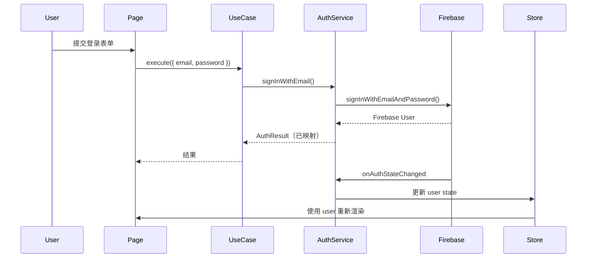
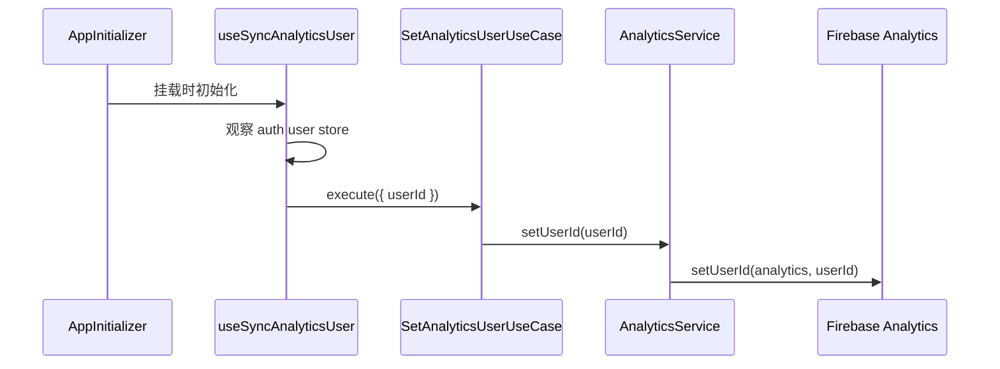

# Firebase 集成

本项目使用 Firebase 进行身份验证、数据持久化和分析。选择 Firebase 是为了**快速 MVP 开发**，同时架构设计确保在需要时可轻松迁移到其他 provider。

## 目录

1. [概览](#概览)
2. [配置](#配置)
3. [身份验证](#身份验证)
4. [分析](#分析)
5. [Firestore Database](#firestore-database)
6. [Security Rules](#security-rules)
7. [更换 Provider](#更换-provider)

## 概览

Firebase 在本项目中提供三项核心服务：

| 服务 | 用途 | 抽象化 |
|------|------|--------|
| **Firebase Auth** | 用户身份验证（邮箱/密码、Google） | `AuthenticationService` interface |
| **Firebase Analytics** | 事件追踪、页面浏览、用户识别 | `AnalyticsService` interface |
| **Firestore** | NoSQL document database | 每模块的 Repository interface |

### 为什么 MVP 选择 Firebase？

- **零后端设置**：身份验证和数据库几分钟内即可就绪
- **慷慨的免费额度**：适合开发和小规模生产
- **实时能力**：内置实时监听器
- **易于集成**：官方 SDK 支持 TypeScript

### 为什么需要抽象化

项目将 Firebase 抽象在 domain interfaces 之后，实现：

- **更换 provider**：切换到 Auth0、Supabase 或自建后端，无需更改 application 代码
- **测试**：单元测试中轻松 mock services
- **渐进迁移**：一次替换一个服务（如保留 Auth，替换 Firestore）

## 配置

### 环境设置

Firebase 配置以 JSON 字符串形式存储在环境变量中：

```bash
# .env.local
NEXT_PUBLIC_FIREBASE_CONFIG='{"apiKey":"...","authDomain":"...","projectId":"...","storageBucket":"...","messagingSenderId":"...","appId":"..."}'
```

### Firebase Config 模块

**位置**：`src/application/config/firebase-config.ts`

```typescript
// Firebase 实例的单例模式
export function getAuthInstance(): Auth | null {
  if (typeof window === "undefined") return null;
  // 返回缓存的 Auth 实例或初始化新实例
}

export function getFirestoreInstance(): Firestore | null {
  if (typeof window === "undefined") return null;
  // 返回缓存的 Firestore 实例或初始化新实例
}

export function getAnalyticsInstance(): Analytics | null {
  if (typeof window === "undefined") return null;
  // 返回缓存的 Analytics 实例（随 Firebase app 提前初始化）
}
```

**关键特性：**

- **仅客户端**：在服务器端返回 `null`（SSR 安全）
- **单例**：缓存实例防止多次初始化
- **延迟初始化**：仅在首次访问时初始化

### DI Container 注册

**位置**：`src/application/register-container.ts`

```typescript
container.register({
  getAnalyticsInstance: asValue(getAnalyticsInstance),
  getAuthInstance: asValue(getAuthInstance),
  getFirestoreInstance: asValue(getFirestoreInstance),
});
```

Services 接收这些工厂函数而非 Firebase 实例本身，便于测试和更换。

## 身份验证

### Domain Interface

**位置**：`src/modules/auth/domain/interfaces.ts`

```typescript
export interface AuthenticationService {
  signInWithGoogle(): Promise<AuthResult>;
  signInWithEmail(email: string, password: string): Promise<AuthResult>;
  signUpWithEmail(email: string, password: string, displayName?: string): Promise<AuthResult>;
  sendPasswordReset(email: string): Promise<AuthResult>;
  signOut(): Promise<void>;
  subscribeToAuthState(callback: (user: AuthUser | null) => void): () => void;
  updateDisplayName(displayName: string): Promise<AuthResult>;
  updatePassword(oldPassword: string, newPassword: string): Promise<AuthResult>;
}
```

### Domain Types

**位置**：`src/modules/auth/domain/types.ts`

```typescript
export interface AuthUser {
  id: string;
  email: string | null;
  displayName: string | null;
  photoUrl: string | null;
  authType: AuthType;
}

export type AuthType = "email" | "google" | "apple" | "other";

export interface AuthResult {
  success: boolean;
  user?: AuthUser;
  errorCode?: AuthErrorCode;
}

export type AuthErrorCode =
  | "invalid-credentials"
  | "email-already-in-use"
  | "weak-password"
  | "user-not-found"
  | "wrong-password"
  | "requires-recent-login"
  | "unknown";
```

### Firebase 实现

**位置**：`src/modules/auth/infrastructure/services/firebase-auth-service.ts`

`FirebaseAuthenticationService` 类：

1. **实现** `AuthenticationService` interface
2. **通过** dependency injection **接收** `GetAuthInstance` 函数
3. **映射** Firebase user 到 domain `AuthUser`
4. **映射** Firebase errors 到 domain `AuthErrorCode`

```typescript
export class FirebaseAuthenticationService implements AuthenticationService {
  constructor(private getAuthInstance: GetAuthInstance) {}

  async signInWithEmail(email: string, password: string): Promise<AuthResult> {
    const auth = this.getAuthInstance();
    if (!auth) return { success: false, errorCode: "unknown" };

    try {
      const result = await signInWithEmailAndPassword(auth, email, password);
      return { success: true, user: this.mapUser(result.user) };
    } catch (error) {
      return { success: false, errorCode: mapAuthErrorCode(error) };
    }
  }

  // ... 其他方法
}
```

### Auth State 管理

**Zustand Store**：`src/modules/auth/presentation/hooks/use-auth-user-store.ts`

```typescript
interface AuthUserStore {
  user: AuthUser | null;
  loading: boolean;
  setAuthState: (user: AuthUser | null, loading: boolean) => void;
}
```

**Sync Hook**：`src/modules/auth/presentation/hooks/use-sync-auth-state.ts`

- 挂载时订阅 auth state 变化
- 用户登录/登出时更新 Zustand store
- 卸载时清理订阅

**初始化**：`src/application/components/app-initializer.tsx`

```typescript
export function AppInitializer() {
  useSyncAuthState();      // 启动 auth state 同步
  useSyncUserSettings();   // 同步用户偏好设置
  useSyncAnalyticsUser();  // 同步 analytics 用户 ID
  return null;
}
```

### 身份验证流程



## 分析

分析模块通过 Firebase Analytics 追踪用户行为，遵循与其他模块相同的 Clean Architecture 模式。

### Domain Interface

**位置**：`src/modules/analytics/domain/interfaces.ts`

```typescript
export interface AnalyticsService {
  logEvent(eventName: string, params?: Record<string, unknown>): void;
  setUserId(userId: string | null): void;
}
```

### Firebase 实现

**位置**：`src/modules/analytics/infrastructure/services/firebase-analytics-service.ts`

`FirebaseAnalyticsService` 类：

1. **实现** `AnalyticsService` interface
2. **通过** dependency injection **接收** `GetAnalyticsInstance` 函数
3. **委托** 给 Firebase SDK 的 `logEvent` 和 `setUserId`
4. **优雅处理** analytics 实例不存在的情况（静默返回）

```typescript
export class FirebaseAnalyticsService implements AnalyticsService {
  constructor(private readonly getAnalyticsInstance: GetAnalyticsInstance) {}

  logEvent(eventName: string, params?: Record<string, unknown>): void {
    const analytics = this.getAnalyticsInstance();
    if (!analytics) return;
    firebaseLogEvent(analytics, eventName, params);
  }

  setUserId(userId: string | null): void {
    const analytics = this.getAnalyticsInstance();
    if (!analytics) return;
    firebaseSetUserId(analytics, userId);
  }
}
```

### Use Cases

**位置**：`src/modules/analytics/application/`

| Use Case | 用途 |
|----------|------|
| `LogEventUseCase` | 记录自定义 analytics 事件及可选参数 |
| `SetAnalyticsUserUseCase` | 设置或清除 analytics 用户 ID |

```typescript
// 记录自定义事件
await logEventUseCase.execute({
  eventName: "button_click",
  params: { button_id: "cta_signup" },
});

// 为已认证用户设置 user ID
await setAnalyticsUserUseCase.execute({ userId: "uid-123" });

// 登出时清除 user ID
await setAnalyticsUserUseCase.execute({ userId: null });
```

### 自动页面浏览追踪

页面浏览由 GA4 Enhanced Measurement 自动追踪。当 GA4 属性启用了"基于浏览器历史事件的页面变化"（默认启用），每次 Next.js 通过 History API（`pushState`/`replaceState`）执行客户端导航时，`page_view` 事件会自动触发。无需自定义 hook。

### 用户 ID 同步 Hook

**位置**：`src/modules/analytics/presentation/hooks/use-sync-analytics-user.ts`

在 `AppInitializer` 中初始化，此 hook：

- 观察 `useAuthUserStore` 中的 auth 用户
- 用户登录时设置 Firebase Analytics 用户 ID
- 用户登出时清除用户 ID

### Analytics 流程



### Module Configuration

**位置**：`src/modules/analytics/module-configuration.ts`

```typescript
export function registerModule(container: AwilixContainer<object>): void {
  container.register({
    analyticsService: asFunction(
      (c) => new FirebaseAnalyticsService(c.getAnalyticsInstance),
    ).singleton(),
    logEventUseCase: asFunction(
      (c) => new LogEventUseCase(c.analyticsService),
    ).singleton(),
    setAnalyticsUserUseCase: asFunction(
      (c) => new SetAnalyticsUserUseCase(c.analyticsService),
    ).singleton(),
  });
}
```

### 记录自定义事件

从任何 client component 记录自定义事件：

```typescript
"use client";

import { useContainer } from "@/common/hooks/use-container";
import type { LogEventUseCase } from "@/modules/analytics/application/log-event-use-case";

export function MyComponent() {
  const container = useContainer();

  const handleClick = () => {
    const logEventUseCase = container.resolve("logEventUseCase") as LogEventUseCase;
    logEventUseCase.execute({
      eventName: "feature_used",
      params: { feature: "export_pdf" },
    });
  };

  return <button onClick={handleClick}>Export</button>;
}
```

## Firestore Database

### Repository 模式

每个需要数据持久化的模块在其 domain layer 中定义 repository interface。

**示例 - Books 模块**

**Interface**：`src/modules/books/domain/interfaces.ts`

```typescript
export interface BookRepository {
  find(userId: string, params: BookSearchParams): Promise<BookSearchResult>;
  get(userId: string, bookId: string): Promise<Book | null>;
  create(userId: string, book: CreateBookData): Promise<Book>;
  update(userId: string, bookId: string, book: UpdateBookData): Promise<Book | null>;
  delete(userId: string, bookId: string): Promise<boolean>;
}
```

**实现**：`src/modules/books/infrastructure/repositories/firestore-book-repository.ts`

### 数据结构

```
Firestore
├── users/{userId}
│   └── books/{bookId}
│       ├── title: string
│       ├── author: string
│       ├── searchText: string（已标准化用于搜索）
│       ├── createdAt: number（epoch ms）
│       ├── updatedAt: number（epoch ms）
│       └── createdBy: string
│
└── user-settings/{userId}
    ├── theme: string
    └── language: string
```

### 功能特性

**用户数据隔离**：每个用户的数据存储在其专属子集合中（`users/{userId}/books`）

**分页**：使用 Firestore 的 `startAfter` 实现基于游标的分页

```typescript
async find(userId: string, params: BookSearchParams): Promise<BookSearchResult> {
  // 构建带排序和分页的查询
  let q = query(
    collection(db, `users/${userId}/books`),
    orderBy("title"),
    limit(params.pageSize + 1) // 多取一条以检查 hasMore
  );

  if (params.cursor) {
    q = query(q, startAfter(params.cursor));
  }

  // 执行并映射结果
}
```

**搜索**：使用已标准化的 `searchText` 字段进行简单文本搜索

**时间戳**：以 epoch 毫秒存储以保持一致性

## Security Rules

**位置**：`firestore.rules`

```javascript
rules_version = '2';
service cloud.firestore {
  match /databases/{database}/documents {
    // 默认拒绝
    match /{document=**} {
      allow read, write: if false;
    }

    // User settings - 用户只能访问自己的
    match /user-settings/{userId} {
      allow read, write: if request.auth != null && request.auth.uid == userId;
    }

    // Books - 用户只能访问自己的 books
    match /users/{userId}/books/{bookId} {
      allow read, delete: if request.auth != null && request.auth.uid == userId;
      allow create, update: if request.auth != null
        && request.auth.uid == userId
        && request.resource.data.createdBy == request.auth.uid;
    }
  }
}
```

**关键原则：**

- 默认拒绝所有访问
- 用户只能读写自己的数据
- 写操作验证 `createdBy` 匹配已认证用户

## 更换 Provider

抽象化架构使得将 Firebase 更换为其他 provider 变得简单直接。

### 更换 Authentication

1. **创建新 service** 实现 `AuthenticationService`：

```typescript
// src/modules/auth/infrastructure/services/auth0-auth-service.ts
export class Auth0AuthenticationService implements AuthenticationService {
  async signInWithEmail(email: string, password: string): Promise<AuthResult> {
    // Auth0 实现
  }
  // ... 实现所有 interface 方法
}
```

2. **更新 module configuration**：

```typescript
// src/modules/auth/module-configuration.ts
container.register({
  authService: asFunction(
    (cradle) => new Auth0AuthenticationService(cradle.auth0Client)
  ).singleton(),
});
```

3. **无需更改** use cases、pages 或 components

### 更换 Database

1. **创建新 repository** 实现 interface：

```typescript
// src/modules/books/infrastructure/repositories/postgres-book-repository.ts
export class PostgresBookRepository implements BookRepository {
  async find(userId: string, params: BookSearchParams): Promise<BookSearchResult> {
    // PostgreSQL 实现
  }
  // ... 实现所有 interface 方法
}
```

2. **更新 module configuration**：

```typescript
// src/modules/books/module-configuration.ts
container.register({
  bookRepository: asFunction(
    (cradle) => new PostgresBookRepository(cradle.dbClient)
  ).singleton(),
});
```

### 更换 Analytics

1. **创建新 service** 实现 `AnalyticsService`：

```typescript
// src/modules/analytics/infrastructure/services/mixpanel-analytics-service.ts
export class MixpanelAnalyticsService implements AnalyticsService {
  logEvent(eventName: string, params?: Record<string, unknown>): void {
    // Mixpanel 实现
  }
  setUserId(userId: string | null): void {
    // Mixpanel 实现
  }
}
```

2. **更新 module configuration**：

```typescript
// src/modules/analytics/module-configuration.ts
container.register({
  analyticsService: asFunction(
    (cradle) => new MixpanelAnalyticsService(cradle.mixpanelClient)
  ).singleton(),
});
```

3. **无需更改** use cases、hooks 或 components

### 迁移策略

分阶段迁移：

1. **阶段 1**：保留 Firebase Auth，用你的后端 API 替换 Firestore
2. **阶段 2**：用企业级方案（Auth0、Okta 等）替换 Firebase Auth
3. **阶段 3**：用你偏好的 provider（Mixpanel、Amplitude 等）替换 Firebase Analytics
4. **阶段 4**：完全移除 Firebase SDK

每个阶段只需更改：
- Infrastructure layer（新的 service/repository 实现）
- Module configuration（DI 注册）
- Environment variables（新的 API endpoints/keys）

Application 和 presentation layers 保持不变。
