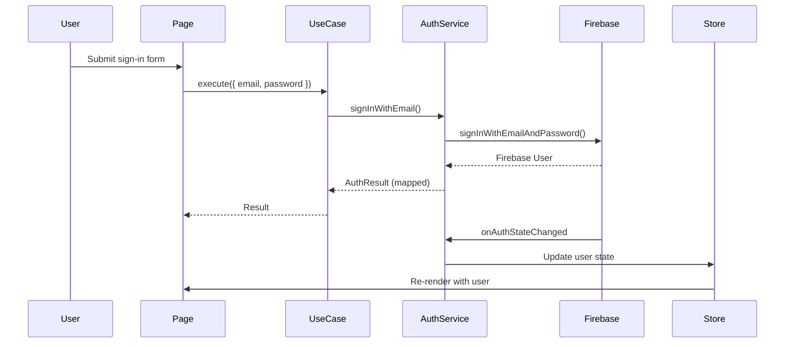
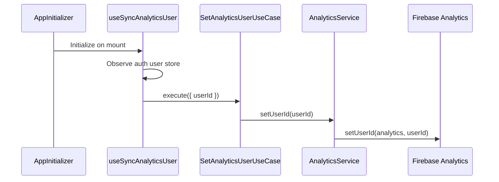

# Firebase Integration

This project uses Firebase for authentication, data persistence, and analytics. Firebase was chosen for **rapid MVP development** while the architecture ensures easy migration to other providers when needed.

## Table of Contents

1. [Overview](#overview)
2. [Configuration](#configuration)
3. [Authentication](#authentication)
4. [Analytics](#analytics)
5. [Firestore Database](#firestore-database)
6. [Security Rules](#security-rules)
7. [Swapping Providers](#swapping-providers)

## Overview

Firebase provides three core services in this project:

| Service | Purpose | Abstraction |
|---------|---------|-------------|
| **Firebase Auth** | User authentication (email/password, Google) | `AuthenticationService` interface |
| **Firebase Analytics** | Event tracking, page views, user identification | `AnalyticsService` interface |
| **Firestore** | NoSQL document database | Repository interfaces per module |

### Why Firebase for MVP?

- **Zero backend setup**: Authentication and database ready in minutes
- **Generous free tier**: Suitable for development and small-scale production
- **Real-time capabilities**: Built-in real-time listeners
- **Easy integration**: Official SDK with TypeScript support

### Why Abstraction Matters

The project abstracts Firebase behind domain interfaces, enabling:

- **Provider swapping**: Switch to Auth0, Supabase, or custom backend without changing application code
- **Testing**: Mock services easily in unit tests
- **Gradual migration**: Replace one service at a time (e.g., keep Auth, replace Firestore)

## Configuration

### Environment Setup

Firebase configuration is stored as a JSON string in environment variables:

```bash
# .env.local
NEXT_PUBLIC_FIREBASE_CONFIG='{"apiKey":"...","authDomain":"...","projectId":"...","storageBucket":"...","messagingSenderId":"...","appId":"..."}'
```

### Firebase Config Module

**Location**: `src/application/config/firebase-config.ts`

```typescript
// Singleton pattern for Firebase instances
export function getAuthInstance(): Auth | null {
  if (typeof window === "undefined") return null;
  // Returns cached Auth instance or initializes new one
}

export function getFirestoreInstance(): Firestore | null {
  if (typeof window === "undefined") return null;
  // Returns cached Firestore instance or initializes new one
}

export function getAnalyticsInstance(): Analytics | null {
  if (typeof window === "undefined") return null;
  // Returns cached Analytics instance (initialized eagerly with Firebase app)
}
```

**Key Features:**

- **Client-only**: Returns `null` on server (SSR-safe)
- **Singleton**: Caches instances to prevent multiple initializations
- **Lazy initialization**: Only initializes when first accessed

### DI Container Registration

**Location**: `src/application/register-container.ts`

```typescript
container.register({
  getAnalyticsInstance: asValue(getAnalyticsInstance),
  getAuthInstance: asValue(getAuthInstance),
  getFirestoreInstance: asValue(getFirestoreInstance),
});
```

Services receive these factory functions, not Firebase instances directly, enabling easier testing and swapping.

## Authentication

### Domain Interface

**Location**: `src/modules/auth/domain/interfaces.ts`

```typescript
export interface AuthenticationService {
  signInWithGoogle(): Promise<AuthResult>;
  signInWithEmail(email: string, password: string): Promise<AuthResult>;
  signUpWithEmail(email: string, password: string, displayName?: string): Promise<AuthResult>;
  sendPasswordReset(email: string): Promise<AuthResult>;
  signOut(): Promise<void>;
  subscribeToAuthState(callback: (user: AuthUser | null) => void): () => void;
  updateDisplayName(displayName: string): Promise<AuthResult>;
  updatePassword(oldPassword: string, newPassword: string): Promise<AuthResult>;
}
```

### Domain Types

**Location**: `src/modules/auth/domain/types.ts`

```typescript
export interface AuthUser {
  id: string;
  email: string | null;
  displayName: string | null;
  photoUrl: string | null;
  authType: AuthType;
}

export type AuthType = "email" | "google" | "apple" | "other";

export interface AuthResult {
  success: boolean;
  user?: AuthUser;
  errorCode?: AuthErrorCode;
}

export type AuthErrorCode =
  | "invalid-credentials"
  | "email-already-in-use"
  | "weak-password"
  | "user-not-found"
  | "wrong-password"
  | "requires-recent-login"
  | "unknown";
```

### Firebase Implementation

**Location**: `src/modules/auth/infrastructure/services/firebase-auth-service.ts`

The `FirebaseAuthenticationService` class:

1. **Implements** `AuthenticationService` interface
2. **Receives** `GetAuthInstance` function via dependency injection
3. **Maps** Firebase user to domain `AuthUser`
4. **Maps** Firebase errors to domain `AuthErrorCode`

```typescript
export class FirebaseAuthenticationService implements AuthenticationService {
  constructor(private getAuthInstance: GetAuthInstance) {}

  async signInWithEmail(email: string, password: string): Promise<AuthResult> {
    const auth = this.getAuthInstance();
    if (!auth) return { success: false, errorCode: "unknown" };

    try {
      const result = await signInWithEmailAndPassword(auth, email, password);
      return { success: true, user: this.mapUser(result.user) };
    } catch (error) {
      return { success: false, errorCode: mapAuthErrorCode(error) };
    }
  }

  // ... other methods
}
```

### Auth State Management

**Zustand Store**: `src/modules/auth/presentation/hooks/use-auth-user-store.ts`

```typescript
interface AuthUserStore {
  user: AuthUser | null;
  loading: boolean;
  setAuthState: (user: AuthUser | null, loading: boolean) => void;
}
```

**Sync Hook**: `src/modules/auth/presentation/hooks/use-sync-auth-state.ts`

- Subscribes to auth state changes on mount
- Updates Zustand store when user signs in/out
- Cleans up subscription on unmount

**Initialization**: `src/application/components/app-initializer.tsx`

```typescript
export function AppInitializer() {
  useSyncAuthState();      // Start auth state sync
  useSyncUserSettings();   // Sync user preferences
  useSyncAnalyticsUser();  // Sync analytics user ID
  return null;
}
```

### Authentication Flow



## Analytics

The analytics module tracks user behavior through Firebase Analytics, following the same Clean Architecture pattern as other modules.

### Domain Interface

**Location**: `src/modules/analytics/domain/interfaces.ts`

```typescript
export interface AnalyticsService {
  logEvent(eventName: string, params?: Record<string, unknown>): void;
  setUserId(userId: string | null): void;
}
```

### Firebase Implementation

**Location**: `src/modules/analytics/infrastructure/services/firebase-analytics-service.ts`

The `FirebaseAnalyticsService` class:

1. **Implements** `AnalyticsService` interface
2. **Receives** `GetAnalyticsInstance` function via dependency injection
3. **Delegates** to Firebase SDK's `logEvent` and `setUserId`
4. **Gracefully handles** missing analytics instance (returns silently)

```typescript
export class FirebaseAnalyticsService implements AnalyticsService {
  constructor(private readonly getAnalyticsInstance: GetAnalyticsInstance) {}

  logEvent(eventName: string, params?: Record<string, unknown>): void {
    const analytics = this.getAnalyticsInstance();
    if (!analytics) return;
    firebaseLogEvent(analytics, eventName, params);
  }

  setUserId(userId: string | null): void {
    const analytics = this.getAnalyticsInstance();
    if (!analytics) return;
    firebaseSetUserId(analytics, userId);
  }
}
```

### Use Cases

**Location**: `src/modules/analytics/application/`

| Use Case | Purpose |
|----------|---------|
| `LogEventUseCase` | Log custom analytics events with optional parameters |
| `SetAnalyticsUserUseCase` | Set or clear the analytics user ID |

```typescript
// Log a custom event
await logEventUseCase.execute({
  eventName: "button_click",
  params: { button_id: "cta_signup" },
});

// Set user ID for authenticated user
await setAnalyticsUserUseCase.execute({ userId: "uid-123" });

// Clear user ID on sign out
await setAnalyticsUserUseCase.execute({ userId: null });
```

### Automatic Page View Tracking

Page views are tracked automatically by GA4 Enhanced Measurement. When the GA4 property has "Page changes based on browser history events" enabled (the default), `page_view` events are fired automatically whenever Next.js performs client-side navigation via the History API (`pushState`/`replaceState`). No custom hook is needed.

### User ID Sync Hook

**Location**: `src/modules/analytics/presentation/hooks/use-sync-analytics-user.ts`

Initialized in `AppInitializer`, this hook:

- Observes the auth user from `useAuthUserStore`
- Sets the Firebase Analytics user ID when a user signs in
- Clears the user ID when the user signs out

### Analytics Flow



### Module Configuration

**Location**: `src/modules/analytics/module-configuration.ts`

```typescript
export function registerModule(container: AwilixContainer<object>): void {
  container.register({
    analyticsService: asFunction(
      (c) => new FirebaseAnalyticsService(c.getAnalyticsInstance),
    ).singleton(),
    logEventUseCase: asFunction(
      (c) => new LogEventUseCase(c.analyticsService),
    ).singleton(),
    setAnalyticsUserUseCase: asFunction(
      (c) => new SetAnalyticsUserUseCase(c.analyticsService),
    ).singleton(),
  });
}
```

### Logging Custom Events

To log custom events from any client component:

```typescript
"use client";

import { useContainer } from "@/common/hooks/use-container";
import type { LogEventUseCase } from "@/modules/analytics/application/log-event-use-case";

export function MyComponent() {
  const container = useContainer();

  const handleClick = () => {
    const logEventUseCase = container.resolve("logEventUseCase") as LogEventUseCase;
    logEventUseCase.execute({
      eventName: "feature_used",
      params: { feature: "export_pdf" },
    });
  };

  return <button onClick={handleClick}>Export</button>;
}
```

## Firestore Database

### Repository Pattern

Each module that needs data persistence defines a repository interface in its domain layer.

**Example - Books Module**

**Interface**: `src/modules/books/domain/interfaces.ts`

```typescript
export interface BookRepository {
  find(userId: string, params: BookSearchParams): Promise<BookSearchResult>;
  get(userId: string, bookId: string): Promise<Book | null>;
  create(userId: string, book: CreateBookData): Promise<Book>;
  update(userId: string, bookId: string, book: UpdateBookData): Promise<Book | null>;
  delete(userId: string, bookId: string): Promise<boolean>;
}
```

**Implementation**: `src/modules/books/infrastructure/repositories/firestore-book-repository.ts`

### Data Structure

```
Firestore
├── users/{userId}
│   └── books/{bookId}
│       ├── title: string
│       ├── author: string
│       ├── searchText: string (normalized for search)
│       ├── createdAt: number (epoch ms)
│       ├── updatedAt: number (epoch ms)
│       └── createdBy: string
│
└── user-settings/{userId}
    ├── theme: string
    └── language: string
```

### Features

**User Data Isolation**: Each user's data is stored in their own subcollection (`users/{userId}/books`)

**Pagination**: Cursor-based pagination using Firestore's `startAfter`

```typescript
async find(userId: string, params: BookSearchParams): Promise<BookSearchResult> {
  // Build query with ordering and pagination
  let q = query(
    collection(db, `users/${userId}/books`),
    orderBy("title"),
    limit(params.pageSize + 1) // Fetch one extra to check hasMore
  );

  if (params.cursor) {
    q = query(q, startAfter(params.cursor));
  }

  // Execute and map results
}
```

**Search**: Uses a normalized `searchText` field for simple text search

**Timestamps**: Stored as epoch milliseconds for consistency

## Security Rules

**Location**: `firestore.rules`

```javascript
rules_version = '2';
service cloud.firestore {
  match /databases/{database}/documents {
    // Default deny
    match /{document=**} {
      allow read, write: if false;
    }

    // User settings - users can only access their own
    match /user-settings/{userId} {
      allow read, write: if request.auth != null && request.auth.uid == userId;
    }

    // Books - users can only access their own books
    match /users/{userId}/books/{bookId} {
      allow read, delete: if request.auth != null && request.auth.uid == userId;
      allow create, update: if request.auth != null
        && request.auth.uid == userId
        && request.resource.data.createdBy == request.auth.uid;
    }
  }
}
```

**Key Principles:**

- Default deny all access
- Users can only read/write their own data
- Write operations validate `createdBy` matches authenticated user

## Swapping Providers

The abstracted architecture makes it straightforward to swap Firebase for other providers.

### Swapping Authentication

1. **Create new service** implementing `AuthenticationService`:

```typescript
// src/modules/auth/infrastructure/services/auth0-auth-service.ts
export class Auth0AuthenticationService implements AuthenticationService {
  async signInWithEmail(email: string, password: string): Promise<AuthResult> {
    // Auth0 implementation
  }
  // ... implement all interface methods
}
```

2. **Update module configuration**:

```typescript
// src/modules/auth/module-configuration.ts
container.register({
  authService: asFunction(
    (cradle) => new Auth0AuthenticationService(cradle.auth0Client)
  ).singleton(),
});
```

3. **No changes needed** in use cases, pages, or components

### Swapping Database

1. **Create new repository** implementing the interface:

```typescript
// src/modules/books/infrastructure/repositories/postgres-book-repository.ts
export class PostgresBookRepository implements BookRepository {
  async find(userId: string, params: BookSearchParams): Promise<BookSearchResult> {
    // PostgreSQL implementation
  }
  // ... implement all interface methods
}
```

2. **Update module configuration**:

```typescript
// src/modules/books/module-configuration.ts
container.register({
  bookRepository: asFunction(
    (cradle) => new PostgresBookRepository(cradle.dbClient)
  ).singleton(),
});
```

### Swapping Analytics

1. **Create new service** implementing `AnalyticsService`:

```typescript
// src/modules/analytics/infrastructure/services/mixpanel-analytics-service.ts
export class MixpanelAnalyticsService implements AnalyticsService {
  logEvent(eventName: string, params?: Record<string, unknown>): void {
    // Mixpanel implementation
  }
  setUserId(userId: string | null): void {
    // Mixpanel implementation
  }
}
```

2. **Update module configuration**:

```typescript
// src/modules/analytics/module-configuration.ts
container.register({
  analyticsService: asFunction(
    (cradle) => new MixpanelAnalyticsService(cradle.mixpanelClient)
  ).singleton(),
});
```

3. **No changes needed** in use cases, hooks, or components

### Migration Strategy

For gradual migration:

1. **Phase 1**: Keep Firebase Auth, replace Firestore with your backend API
2. **Phase 2**: Replace Firebase Auth with enterprise solution (Auth0, Okta, etc.)
3. **Phase 3**: Replace Firebase Analytics with your preferred provider (Mixpanel, Amplitude, etc.)
4. **Phase 4**: Remove Firebase SDK entirely

Each phase only requires changes in:
- Infrastructure layer (new service/repository implementations)
- Module configuration (DI registration)
- Environment variables (new API endpoints/keys)

Application and presentation layers remain unchanged.
